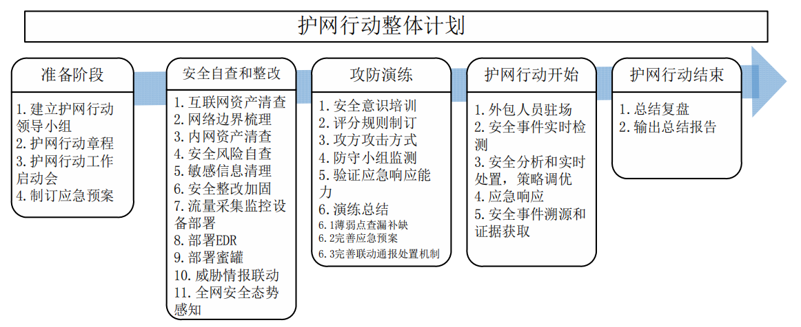
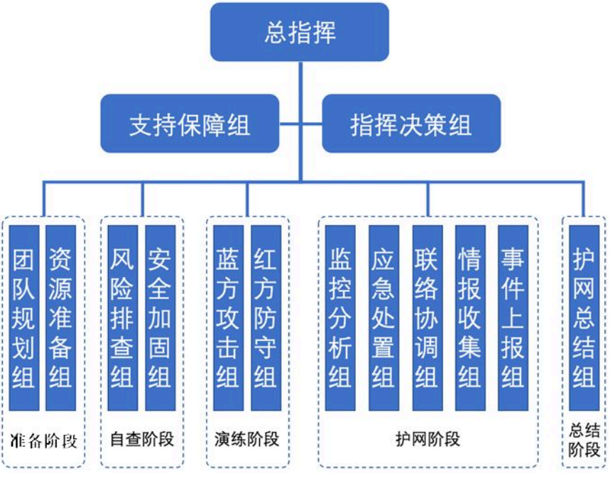
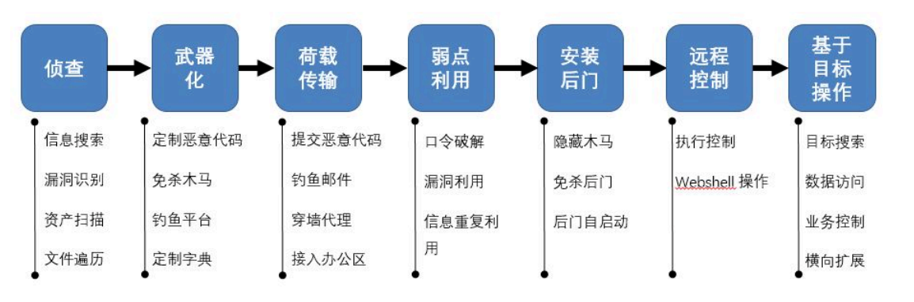

# 1.护网目标

## 1.1 概述

护网行动是公安机关统一组织，通过攻防演练为主要手段，针对互联网、关键基础设施、重要信息系统开展的网络安全执法检查

**禁止行为**

* DDOS
* 破坏性的物理入侵
* 有感染性的木马和病毒

## 1.2 行动目标

* 协作分工，明确职责，充分准备
* 强化全体员工网络安全意识
* 全面检查、缩小网络攻击面
* 预先攻防演练，查缺补漏，检验安全监测体系和应急响应能力
* HW期间，确保目标系统安全，减少失分

# 2.护网行动流程

## 2.1准备阶段

## 2.2 安全自查和整改

### 2.2.1 互联网资产梳理

通过资产情报服务对在线资产进行侦察，识别边缘资产、遗漏服务、对外暴露的高危服务等

* 缩减、集中互联网出入口
* 加强域名管理
* 加强终端管理
* 清理老旧资产
* 加强APP管理

### 2.2.2 网络边界梳理

* 网络边界设备白名单管控
* 关闭高危端口和协议
* 最小权限开放IP和端口
* 排查数据网的路由策略

### 2.2.3 内网资产梳理

* 网络拓扑图
* 清查IP地址使用情况
* 清理系统
* 网络安全布防图

### 2.2.4 安全风险自查

* 主机安全自查：主机安全基线、数据库安全基线、中间件安全基线、主机漏洞
* 应用系统安全自查：系统合规检查、源代码审计、系统渗透测试
* 运维终端安全自查
* 日志审计
* 备份有效性检查

### 2.2.5 敏感信息清理

* 内部敏感资料：登录口令、网络安全配置、渗透测试报告、公司敏感材料等

### 2.2.6 安全整改加固

* 收敛攻击面
* 纵深防御
* 重点资产监控
* 态势感知+蜜罐诱捕+威胁情报

## 2.3 模拟攻防演练

### 2.3.1 安全意识培训

* 不要随意打开陌生可以邮件或链接
* 不在电脑中存储明文密码
* 不允许未授权人员进入办公场地
* 不允许弱口令

### 2.3.2 评分规则

攻击方

| 分类                               | 赋值                                |
| ---------------------------------- | ----------------------------------- |
| 获取终端权限                       | 10分/台                             |
| 获取webshell权限                   | 20分/个                             |
| 获取邮箱、FTP、VPN、数据库账号密码 | 普通权限 20 分/个、管理员 60 分/个  |
| 湖区web、邮件、数据库服务器权限    | 普通权限 60 分/个、管理员 100 分/个 |
| 域控权限                           | 管理员300分/个                      |
| 路由器、交换机、防火墙等设备权限   | 接入层50分/个、汇聚层100分/个       |

防守方

| 工作阶段     | 得分标准                                                     | 赋值                                   |
| ------------ | ------------------------------------------------------------ | -------------------------------------- |
| 发现攻击     | 发现木马                                                     | 50分/个                                |
|              | 发现钓鱼邮件                                                 | 20分/个                                |
|              | 发现漏洞攻击                                                 | 50分/个                                |
| 消除威胁     | 处置webshell木马/主机木马                                    | 50分/个                                |
|              | 处置web系统、FTP异常账号                                     | 20分/个                                |
|              | 处置主机异常账号                                             | 50分/个                                |
| 配合应急处置 | 积极配置应急组工作，快速定位受害系统，提供充分日志记录，固定证据 | 高效完成：+300分、一般：+200、差：-100 |

### 2.3.3 应急响应

* 网络攻击事件应急

当发现网络被非法入侵、网页内容被篡改，应用服务器的数据被非法拷贝、修改、删除时，封锁或删除有攻击意图的登录账户，阻断可疑用户进入网络的通道，并及时清理系统、恢复数据和程序，尽快恢复系统和网络的正常运行

* 恶意软件入侵事件应急

使用杀毒软件扫描查杀，对关键数据备份，清除后持续监控

### 2.3.4 演练总结

* 安全防御体系查缺补漏
* 安全团队应急响应能力总结
* 完善联动通报处置机制

# 3.护网行动经验总结

* 流量+日志，提升安全检测分析能力
* 流量探针多节点部署，统一管理

