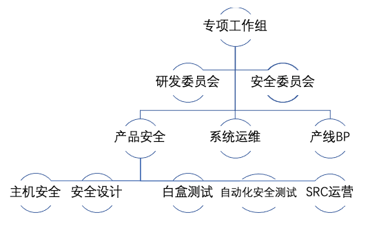
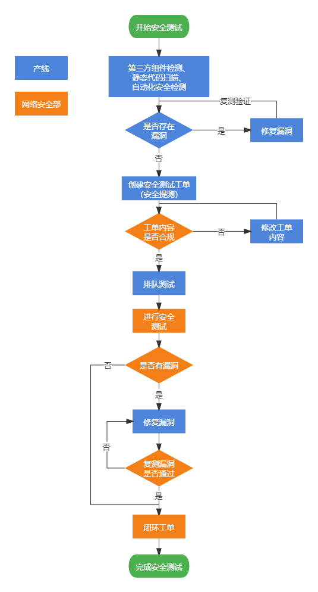
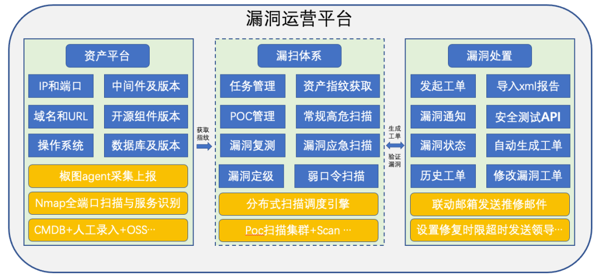
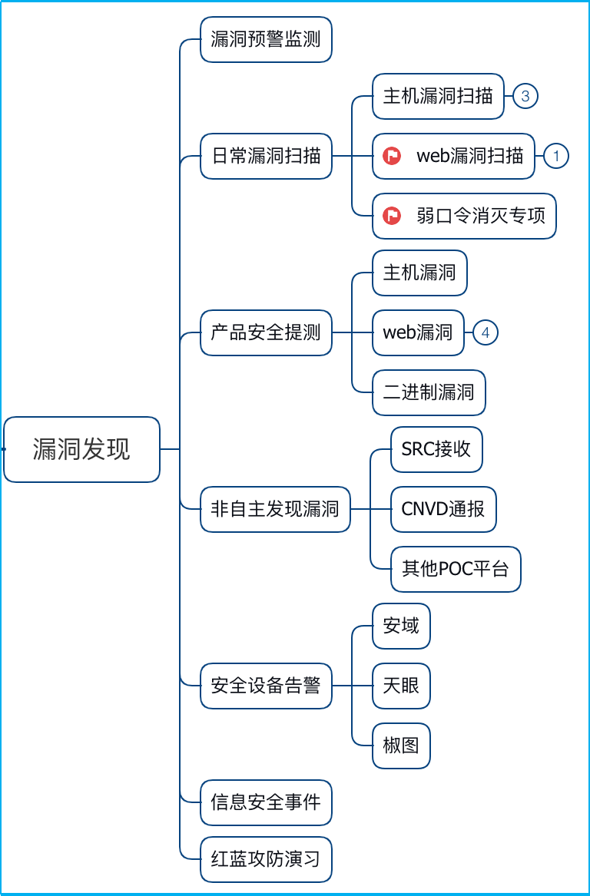
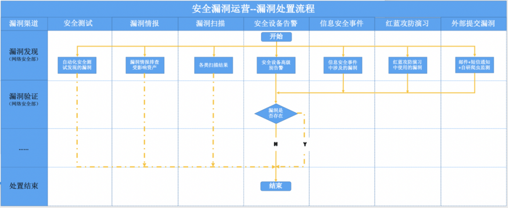
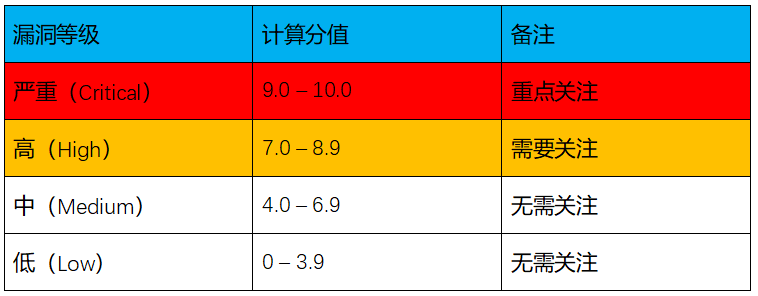
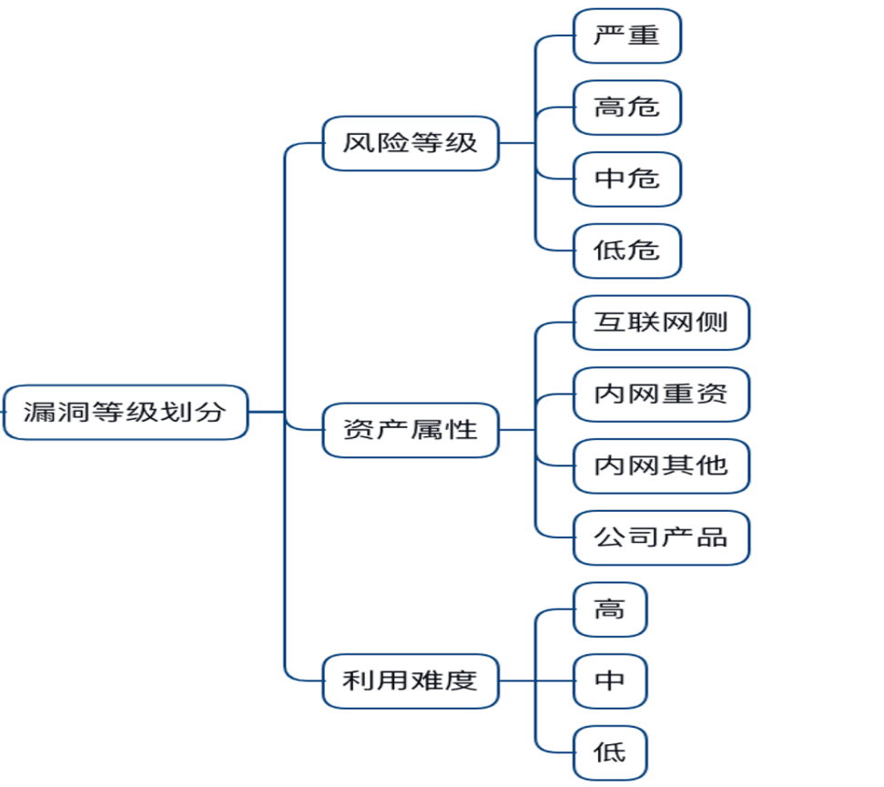
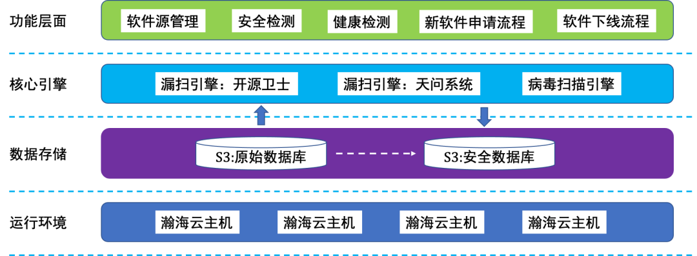

# 0x01 漏洞管理团队

## 1.1 集团级管理团队

* 专项工作组：包括产品、开发、测试、运维、安全等不同角色的人员

>明确该岗位的工作目标与工作职责，比如，研发需要对自己所写程序的安全质量负责，主动学习安全人员提供的开发安全规范、进行开发安全考试、在编码时安装安全IDE 插件进行安全检查、编码完成后触发静态代码安全扫描工具进行安全检测、针对安全检测结果联动安全人员进行漏洞确认与修复、在运营阶段若是发现产品编码相关漏洞需要及时响应与修复

* 部门BP制度：建立部门的安全接口人，负责对接安全人员上传和下达消息、在本部门落地相关安全要求

> 前期可对接口人的配合情况和工作质量进行排名、正向反馈，最终需要落实到绩效考核上。安全接口人需要对部门内部的产品、研发、测试人员进行联动、驱动，承接部门漏洞的管理职责。

## 1.2 部门级管理团队

* 安全防护团队：设置专岗人员进行资产信息收集与识别、最新漏洞跟进分析、编写POC、执行漏洞扫描等工作；
* 安全运营团队：安全运营人员通过日常安全设备的告警，发现漏洞并提交漏洞工单；
* 安全产品团队：负责产品上线前的安全测试及SRC 运营，通过引入白盒测试、黑盒测试和灰盒测试等方法发现并推动漏洞修复。

# 0x02 漏洞管理嵌入流程

## 2.1 漏洞管理嵌入开发流程

* 在产品发布节点上设置了安全卡点，未经过安全提测或安全提测结果不达标的产线，将被禁止发布上线

## 2.2 漏洞管理联动资产管理流程

* 无论是漏洞的发现，亦或是漏洞的修复，均需要明确存在漏洞的资产归属情况，故资产管理是漏洞管理的另一个基础。基于资产（操作系统/应用/组件）进行漏洞扫描，可以提升扫描效率、降低网络流量；基于资产（重要级别/网络位置）进行漏洞修复判断，可以提高必修的漏洞修复率；基于资产（使用人/运维负责人/安全负责人）进行漏洞修复推动，可以提高整体的漏洞修复率

## 2.3 漏洞发现方法

## 2.4 漏洞预警监测

通过从安全媒介、软件官网、国内外漏洞平台、社交软件等途径，实时获取漏洞情报信息、漏洞利用信息等，结合公司的信息资产对内进行预警。对于银行、证券、运营商等行业，还会收到来自上级监管单位的漏洞预警通知。常见的漏洞监测情报包括CNVD、CNNVD、CVE Details、CVE等漏洞平台；可以是Freebuf、安全脉搏等安全媒体；还可以是微信朋友圈、推特等社交软件。

对漏洞情报的处理，是接收到漏洞情报后应立即开展的工作，也是对安全人员对自身资产熟悉情况、对新漏洞理解的考验。通常若漏洞有CVSS评分，则可以直接关注7.0分及以上的漏洞，进一步还需要结合以下几个维度进行综合评估。

- 漏洞利用危害程度：漏洞被利用后造成的直接危害；
- 漏洞利用难易程度：有无公开POC、EXP，是否需要登录等；
- 受漏洞影响资产的属性：资产所在网络位置（公网或内网）、资产重要程度（重要系统或一般系统）；
- 监管或上级单位发文通知的漏洞（非普适）；
- 漏洞修复成本和对业务的影响。

## 2.5 日常漏洞扫描

定期使用扫描器对资产进行主机漏洞和Web漏洞扫描，是较为常见发现线上系统安全漏洞的方式之一。扫描频率和扫描规则决定漏洞的发现能力，扫描频率原则上在能覆盖所有资产的基础上越频繁越好，扫描规则需要根据漏洞情报或厂商及时更新。在常见的漏洞工具中，无论是系统还是Web层面，一般都支持登录扫描，但以此带来影响业务的风险也随之增大，特别是实时性要求很高的业务系统对扫描比较敏感，所以在进行扫描前需要注意以下事项。

**· 扫描器地址加白：**扫描器的地址加白包含两层意思，一是在一些特殊的网段或业务系统放行扫描请求，实现覆盖率全局覆盖；另一方面是在安全防护设备上添加白名单，防止被安全设备拦截导致扫描无果，同时也减少扫描时产生的大量告警，避免给安全运营带来巨大的工作量、已知的扫描告警淹没掉有真正攻击的有价值的告警。

**· 设置扫描时间窗口：**从扫描类型（系统/Web漏洞）和扫描目标（内网/外网系统）进行区分，设置每天扫描开始和结束的时间，每月/每季度的扫描频率，在制定的时间内进行扫描工作。

**· 扫描前通知业务方：**将制定的扫描任务与计划在开始前，同步到业务方并获得其统一，可以提高扫描时出现线上故障的处置效率。另外有一些业务系统也会反馈不能扫描，需要添加扫描的白名单。

**· 留意加白业务系统：**针对扫描加白的业务系统，可以通过进一步确定扫描作业开始时间、加大扫描周期、扫描一比一的测试/预发环境、根据系统架构等基础信息进行精细化扫描等多种方式来发现漏洞，防止因为加白而导致的扫描盲点。

**· 多款扫描器交叉扫描：**不同扫描器的规则（能力）不一致，对漏洞的检出能力也有所差异。从黑客攻击、上级单位扫描检查等角度出发，需要将常见的扫描器加入到扫描武器库中，实现漏洞在被人发现之前先发现，掌握一定主动权。

**· 对扫描器的操作进行审计：**由于在网络和防护层面都对扫描器开放，扫描器上已知漏洞也属于公司的重要资产信息，需要对扫描器的登录、登出、扫描任务制定等关键操作进行审计，做到事后可取证追溯。

## 2.6 产品安全提测

业务上线前进行安全测试，基本已经成为拥有安全人员的企业必做安全工作之一，也是漏洞发现的主要来源。通过建立安全提测流程，设置业务上线卡点和安全质量要求，促使业务上线前都来进行安全测试并进行漏洞修复。

下面介绍几种常见的安全测试模式，不同企业一般都是有一种或几种搭配组合。

**· 黑盒主动漏扫：**这应该是最常见的发现漏洞方式，也常常作为安全测试中的安全基线，使用工具通过爬虫获取待检测系统的API，加载各类payload进行漏洞扫描，包括主机漏洞扫描和Web漏洞扫描。主机漏洞扫描器基本都是商用的，比如Nessus、绿盟RSAS等；Web漏洞主动式扫描工具种类较多，包括耳熟能详的AWVS、w3af、Nikto、OWASP_ZAP等，大多都可通过开源方式获得。黑盒主动漏扫能发现常见的漏洞，但是在覆盖面方面存在一定的不足，就Web漏扫而言，针对单个链接的孤岛因为爬虫找不到路径、使用防重放一次失效token的页面等，通常会检测不到。

**· 黑盒被动漏扫：**相对于主动方式的漏洞扫描而言，被动漏扫最大的区别就是获取的URL来源不同，一般包括通过流量提取和日志解析。在功能测试时或者线上环境产生的流量中，提取待测系统的URL、去重、加载payload、重放进行安全测试，从而覆盖到用户能接触到的所有系统功能。至于工具方面，以商业和大型互联网公司自研两种形态为主；另外也出现一些社区版的产品，比如xray；半自动化的工具Burpsuite + 自研漏洞插件进行漏洞扫描。

**· 白盒安全测试：**在安全测试领域，静态代码扫描通常作为安全测试在开发安全生命周期中左移一步的重要标识。通过对代码进行安全扫描，可丰富被发现的安全漏洞的种类，比如除了常见的SQL注入、XSS、CSRF等OWASP Top10类型外，还能检出硬编码密码、不安全的随机数、日志伪造、路径操纵等类型的漏洞。

**· 手工安全测试：**无论是黑盒还是白盒安全测试，工具发现的漏洞总是有限的，都需要人工的参与。在逻辑漏洞、敏感信息泄露类、有一定防范但可被绕过类漏洞方面，检出率存在短板，往往需要人工根据经验、结合实际的业务场景进行手工分析测试。

**· 交互式安全测试：**IAST技术将白盒和黑盒安全测试的能力进行融合，能将漏洞定位到代码层面，漏洞检出率高、误报率极低，甚至能做到不产生脏数据（IAST的Passive插桩技术）。在DevSecOps日益推行的今天，IAST必将是安全测试技术的发展方向。

## 2.7 非自主发现漏洞

漏洞悬赏最开始流行在国外的HackerOne、Bugcrow等平台，到国内主要以漏洞平台和SRC的形式落地。各大互联网公司也纷纷建立SRC，对外收集自家产品与信息系统以及主流产品的0day漏洞，往往也能收到不少高价值的漏洞。

SRC作为企业安全团队对外宣传、接收漏洞的官方渠道，既能起到沟通桥梁的作用，又可以通过接收到的漏洞反向优化安全防护策略。建设SRC早的企业，各类规则完善、人气高，基本拥有一群稳定的白帽子为其挖洞，白帽子也对业务越来越熟悉，也能发现更多有质量的安全漏洞。对于新建的SRC，则需要通过不断的运营活动来提升行业影响力，吸引更多的白帽子加入。

**· SRC建立：**包括门户建立、漏洞接收范围确定、奖励机制确定等。

一是门户的建立，作为一个对外的门户，可以自研也可以通过国内的一些漏洞平台建立企业SRC，漏洞平台的好处是有一定的白帽子基础、运营机制，相比较自研会更加高效快速上线，但也存在定制化功能和效果不佳的弊端。若是自研，可借助开源的程序进行修改，比如SRCMS、腾讯xSRC（开源版）。值得注意的是，如果使用开源方案，则需要持续关注平台本身的漏洞情况，目前已经被发现不少安全漏洞。

二是确定漏洞接收范围，仅限于主域名的子域名，还是包括所有与公司相关的资产漏洞？SRC经常会接收到内部已知管理资产外的资产漏洞，白帽子的能力不容小觑，为避免发生争执需要提前明确。

三是设置有明显区别的漏洞奖励机制，可根据资产重要性、漏洞利用直接造成的影响、漏洞利用条件等进行评判。比如核心系统可利用前台SQL注入漏洞的评级，应该比核心系统管理员之后可利用的SQL注入和一般系统前台可利用SQL注入高，对应的奖励机制也会更高。对于奖励机制，直接进行RMB奖励会更吸引白帽子的参与度。

**· SRC活动：**漏洞接收数量直接取决于参与白帽子的数量，衍生开可能涉及到平台影响力、奖励机制等因素。白帽子拉新、白帽子促活、每逢佳节奖金翻倍、月/季/年度额外奖励…需要有规划、有吸引力的发起线上或线下活动，保持与白帽子的联系。

**· 其他事项：**把跟白帽子的关系处理当做一项正式运营工作，给予白帽子感谢与尊重；注重在安全圈内的品牌，加入生态圈，与其他SRC一起活动，能吸引更多白帽子；制定内部漏洞审核和修复效率，别让线上漏洞暴露太久，也别让白帽子等待太久。

## 2.8 安全设备告警

企业一般都会部署安全设备，常见的有安全审计类，比如堡垒机、日志审计系统、数据库审计系统；主动防御类，包括漏洞扫描系统、配置核查系统、IPS等；被动防御类，有WAF、IDS、主机安全防护软件…这些设备产生的告警除了能发现有人攻击外，还能通过告警信息分析出信息系统的漏洞。

以内部流量分析系统，举例进行说明：在镜像到流量分析系统前进行SSL证书卸载，一切将变得透明化。网络中的攻击、请求包中的弱口令，在流量系统上将得到还原，通过其可以发现应用层之外的网络攻击情况

## 2.9 信息安全事件

信息安全事件的发生，往往是最不愿意看到的，但也是不得不直面与不可避免的。通过复盘信息安全事件来发现漏洞，进行同类漏洞纵向（比如信息安全事件由redis未授权访问导致，在进行复盘时对全网的redis服务进行未授权访问和弱口令排查）和横向（比如信息安全事件还是由redis未授权访问导致，则可以扩展到对resync、memcache、ftp、Jenkins、solr等可能存在的服务进行排查）治理，发挥事件的最大价值。

## 2.10 红蓝攻防演习

类似于信息安全事件，红蓝攻防演示目标则更明确，偏重于漏洞链的组合利用、通过漏洞不断向目标一步步靠近，对于蓝队来说是很大的挑战，也是一次不错的对防守能力、应急处置能力的检验。

红队即攻击发起方，通常会通过网站、VPN、邮件系统、Web应用漏洞打开入口，结合对内部员工发邮件、即时通信的钓鱼攻击，以及物理攻击、供应链攻击等方式进入内网并获取权限，在内网攻击域控、堡垒机、云平台、单点登录系统、集中运维管理平台等重要系统，以点打面扩大战果。

对于蓝队，则需要通过各安全设备监测到的异常进行快速处置和分析，尽可能早的发现红队的攻击，制止并掐断攻击路线。在整个攻防过程中，漏洞的利用不可或缺，通过红蓝攻防演示也能收到很多不错的漏洞利用链。

# 0x03 漏洞验证与闭环

## 3.1 漏洞验证

漏洞验证主要是指对从外部接收到的漏洞进行测试，判断是否真的存在，由安全工程师进行，需要业务方配合提供环境、协作、确定及评估漏洞影响程度。

为保证漏洞的真实性和有效性，在发现漏洞之后进行验证十分有必要，可避免将不存在的漏洞直接推送给业务方，给安全团队带来不专业、权威性削减等负面影响，通常已经确定不需要进行验证的情况包括：安全测试、漏洞情报、漏洞扫描，需要进行漏洞验证的场景有以下几种：

**· 安全设备告警：**一次漏洞挖掘与利用攻击会带来很多数据包及告警信息，根据SourceAddress和DisnationAddress进行聚合分析，结合response情况判断出存在漏洞的参数、payload、漏洞类型，并在对应的环境中进行验证。

**· 信息安全事件：**从安全事件中提取防护体系中的漏洞，可能是技术上的也可能是管理上的，针对技术层面的漏洞发现需要分析日志来确定，并从攻击者的角度对漏洞进行还原，确定漏洞真实存在。

**· 红蓝攻防演习：**红蓝对抗中的漏洞也一样，除了分析各类日志，由于是公司自己的红队，还会提供详细的漏洞报告，在此基础上验证漏洞更加快速、有效。

**· 外部提交漏洞：**外部提交的漏洞存在描述信息不详细、逻辑思维混乱、截图不全等情况，在安全人员进行验证时比较苦恼，为避免出现该类情况需要和白帽子沟通补全信息，在制定SRC奖励规则时，也需要将提交高质量报告考虑进去。然而对于从CNVD上、其他POC平台上收到的漏洞信息，较难以控制。

## 3.2 漏洞闭环

漏洞的管理重点在发现方法，难点在漏洞闭环，只有当漏洞被修复才是最终目的。当业务方完成修复的反馈后，安全人员接下来要对漏洞进行复测验证。

在进行漏洞复测时，需注意：

- 要求在漏洞相应处备注修复方法甚至贴修复代码截图；
- 关注修复方案或补丁可能带来的安全缺陷；
- 确认修复后的代码已经提交到仓库，并且更新到待验证的环境；
- 把开发说的话当作不可信的输入，不能不验证就关闭漏洞；
- 严重与高危漏洞，须在生产环境中跟进验证。

## 3.3 漏洞复盘机制

漏洞复盘主要是指通过对漏洞产生的原因进行分析、验证安全防护检测有效性以及漏洞修复情况，从而将漏洞的价值发挥到最大化，以此提升纵深安全防护能力。

### 3.3.1 复盘范围

通常的复盘工作，大多是由于信息安全事件触发，关注范围仅是造成安全事件或通过外部渠道接收的漏洞，却忽视了内部主动发现的漏洞。然而，内部发现的漏洞往往是最多的，复盘价值高、很有必要性。

### 3.3.2 复盘关注点

对漏洞产生的根本原因进行分析，应该考虑系统安全基线是否存在问题、安全配置是否正确，安全开发规范落实情况、安全设计培训效果等。从需求设计、功能实现、配置上线等程序开发的最初环节进行分析，相比较设置的各个安全活动，并细化到每个安全活动的落地情况。

当漏洞被发现时，就意味着安全策略的绕过或失效。以被外部发现安全漏洞为例，追溯到漏洞产生的源头，回顾漏洞被触发的整个过程，并寻找预期与实际情况的差距。

**· 基础安全加固：**漏洞所在服务器的系统服务、所使用Web框架是否按照安全基线要求进行配置？若无，则应分析出具体原因并进行覆盖；若有，则要查看执行细节、反馈完善现有安全基线模板。

**· 应用安全测试：**漏洞发生的系统，在上线前是否经过安全提测？若无，需要分析出被旁路的原因并重新规划设置卡点；若有，则关注漏洞是否已经被发现（包括已发现未修复的原因、未发现的原因）并制定补强措施反馈到现有工作。

**· 安全设备能力：**漏洞在被测试以及利用时，现有设备是否产生告警，包括Waf攻击事件告警、流量分析系统告警、主机安全防护事件告警？若无，需要检测安全设备的覆盖情况并进行部署与安装；若有，则需验证安全设备真实的检测能力并通过新增规则、开启功能等进行防护。此外安全设备产生告警的运营及处置及时性也特别重要，应设置完善的SOP进行管理。

## 3.4 漏洞评价体系

CVSS（Common Vulnerability Scoring System，通用评估漏洞方法），是业界公认的漏洞评估方法，通过对漏洞进行打分将其分为严重（Critical）、高（High）、中（Medium）、低（Low）四个级别。

但在实际的漏洞管理工作中，除非是客户或合作伙伴有所要求，一般会由于考量指标过多、企业安全人员能力有限等诸多因素而难以落地。从攻击者的角度出发，通常可以结合漏洞利用难易程度（包括POC/EXP是否公开，漏洞触发条件，比如是否需要登录认证后才能触发漏洞）和漏洞风险等级 （指漏洞被利用时，对其所在主机产生的直接影响，比如CVE-2020-1947 ShardingSphere 4.0.0及以下版本存在反序列化漏洞，直接导致远程命令执行，造成影响较大）。对漏洞分为以下四个等级：

- 严重（Critical）：漏洞利用条件简单、单个漏洞直接影响大。
- 高危（High）：漏洞利用条件有一定门槛比如需要登录、单个漏洞直接影响大。
- 中危（Medium）：漏洞利用条件较难须在一定环境下、单个漏洞直接影响大；或漏洞利用条件简单、单个漏洞直接影响不大。
- 低危（Low）：漏洞利用条件苛刻、单个漏洞直接影响小；或漏洞利用简单、单个漏洞直接影响极小。

在漏洞的推动修复过程中，往往还应加上资产属性这一维度。资产属性包括互联网侧资产、内网重要信息系统、内网其他信息资产，在进行加固修复时优先级依次降低。

## 3.5 漏洞管理转向预防

在造成安全事件前，发现漏洞并修复成本会降低；在引入或开发过程前期，发现漏洞并修复漏洞成本会更低。此外，切断漏洞的利用链，也是漏洞管理中降低成本的常见有效方法之一。因此，对于在引入漏洞前或当时，制定一些消减措施变得十分有必要。

### 3.5.1 制定安全基线

尤其是第三方开源软件，存在较多的未授权、默认口令和已知可利用的CVE漏洞。在使用前依据CIS制定企业级的安全基线，提供给产品线或直接定期维护软件库、镜像源，保障初始状态是默认安全的。在实践中，内部建立了开源软件运营平台来实现这一功能，架构图如下图所示：

### 3.5.2 引入安全组件

在安全测试中，经过对安全测试的结果进行分析发现：漏洞主要集中在几类安全漏洞，包括SQL注入、XSS、文件上传、OGNL表达式注入、OS命令注入、Nashorn引擎脚本（任意代码执行）、csrf、XXE、不安全的解压缩等。为了提升产线的漏洞修复效率，在漏洞修复阶段给其提供相关的安全组件，从而减轻了开发的工作量。但最主要的还是要求产品线在编码时，引入这些安全组件，在静态代码时进行检验，确保正确使用安全组件，在编码阶段解决常见的漏洞。

