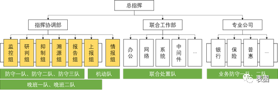
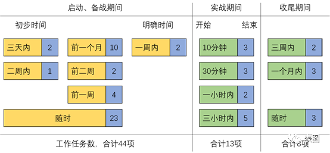
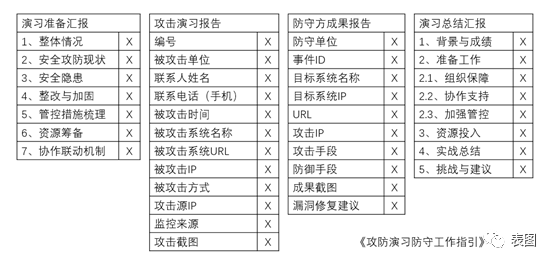

**一、演习防守标准化的意义**

为了更好地理解防守标准化理念，需要安全团队理解防守标准化对我们攻防演习的促进作用和积极意义。

一是在攻防对抗过程中获得最佳秩序，对实际的或潜在的演习活动、重保任务等制定共同的、可重复使用的规则，提高企业安全团队的安全运营效率。

二是标准化防守方的时间进度、任务内容、实施交付成果，是安全团队主动积累技术储备、快速训练队伍反应、培养攻防人才的重要手段。

三是标准化攻防演习的防守活动，能够保证演习质量、防止问题重复发生，是安全运营专业化的前提，红蓝对抗持续深化的必然路径。

**二、防守方的组织架构建议**

在大型企业或集团型公司中，组织一次攻防演习是一项极其复杂并且需要多方高度协同的工作，其演习时期，安全团队与相关方团队的组织架构设计会直接影响到协同的效率和最终参演防守的效果。下图为一种攻防演习的组织架构设计建议供参考，不同的组织架构设计会有不同的利弊、优劣，在此处不做展开。

**三、演习防守标准化的三个维度**

演习防守方可以从三个维度来制定防守活动的标准，分别是时间进度、任务内容和交付成果。

- 时间进度就是从时间视角，明确演习全过程的各关键时间节点，按照时间节点将整个演习全过程定义出可量化的时间节奏，其达到的效果是将过程标准化。
- 任务内容就是从做事视角，将演习前的准备、演习中和演习后等阶段具体工作内容进行细化和明确，其达到的效果是将任务输入标准化。
- 交付成果就是从成事视角，将输入的任务进行完成，形成有效的、达标的成果价值，其达到的效果是将输出标准化。

**四、 时间进度（过程标准化）实践分享**

我们将演习全过程分为“备战”和“实战”两个阶段。第一阶段备战是演习前期的准备，一般从初次收到攻防演习通知开始，启动演习工作组，做备战前各项安全加固准备；第二阶段实战一般是从确定了具体的、不再调整的演习日期开始，到演习结束后的收尾工作全部完成为止。

过程标准化的第一阶段，往往以月、周、天为单位，采用倒计时的方式来排期工作任务，明确在多长时间内完成什么任务或在什么时间点完成什么任务。第二阶段，一般以小时、分钟为单位，明确什么事件或操作在多久时间内完成。

例如：备战期间，演习明确时间前一个月时，对重要系统开启双因素；演习明确时间前一周时，对已启用双因素的系统进行有效性再次检视；实战结束的收尾期间，三周内完成复盘、总结和汇报工作；一个月内完成演习期间各项费用报销等。

**五、任务活动（输入标准化）实践分享**

在什么时间点做什么任务，具体的任务活动便是输入的标准化，我们需要清晰明确的任务活动清单，或在系统平台中形成演习防守任务库，而不是每次要安全团队头脑风暴，或基于个人经验来决定攻防演习各过程做什么事。

下表将攻防演习的防守任务活动按照四个阶段，进行清单式展示，供大家参考。

| **任务阶段** | **任务序号**         | **任务活动名称**     | **责任人** |
| ------------ | -------------------- | -------------------- | ---------- |
| 启动         | A1                   | 确定组织架构         | 张三       |
| A2           | 明确各团队分工职责   | 张三                 |            |
| A3           | 召开动员大会         | 张三                 |            |
| 备战         | B1                   | 发起风险、漏洞等检视 | 李四       |
| B2           | 组织全面扫描         | 李四                 |            |
| B3           | 建立演习联动机制     | 李四                 |            |
| B4           | 推进安全加固整改     | 张三                 |            |
| B5           | 组织内部红蓝对抗演练 | 张三                 |            |
| B6           | 准备专项资源         | 张三                 |            |
| B7           | 同步宣导管理要求     | 李四                 |            |
| 实战         | C1                   | 监控与发现事件       | 李四       |
| C2           | 研判分析事件         | 李四                 |            |
| C3           | 抑制措施             | 张三                 |            |
| C4           | 溯源攻击路径与攻击源 | 张三                 |            |
| C5           | 报告、上报与澄清     | 张三                 |            |
| C6           | 倒计时               | 李四                 |            |
| 收尾         | D1                   | 回退实施             | 李四       |
| D2           | 复盘报告与提升优化   | 李四                 |            |
| D3           | 总结并汇报战果       | 张三                 |            |
| D4           | 表彰、申报与答谢     | 张三                 |            |
| D5           | 庆功宴及报销         | 张三                 |            |

- 

**六、交付成果（输出标准化）实践分享**

每项任务活动（输入标准化）按照时间进度（过程标准化）要求，完成交付成果（输出标准化）。交付成果就是各项输出的明细，可以是按模板完成必要信息的反馈，可以是报告文档文件，亦可是系统中的加固策略、规则等，总之，需要对交付成果进行清晰、明确的定义，确保最终交付的保质保量。

交付成果与任务活动是一一对应的关系，每项任务活动会产出若干交付结果。

下表是攻防演习的防守任务活动对应交付成果的简要说明，供大家参考。

| 任务序号 | 交付成果                                                     | 数量 | 交付类型       |
| -------- | ------------------------------------------------------------ | ---- | -------------- |
| A1       | 参演单位、参演人员、架构宣导等                               | X次  | 文档           |
| A2       | 职责分工说明、培训指导等                                     | X份  | 文档           |
| A3       | 会议邀约、启动会宣导材料等                                   | X    | 文档           |
| B1       | 风险检视通知、漏洞清单、漏洞修复指引等                       | X    | 平台工具、文档 |
| B2       | 高危端口收敛表、联通性测试与隔离等                           | X    | 平台工具、文档 |
| B3       | 备战周例会、事项跟进记录表、值班排班表等                     | X    | 文档           |
| B4       | 防控升级、统一改密、启双因素、收发邮件限制等                 | X    | 平台工具       |
| B5       | 演练方案、演练剧本、演练环境搭建、演练动员与培训等           | X    | 文档、平台工具 |
| B6       | 安全设备备件、专用场地、专用视频会议、专用电话会议、专用邮件群组、专用文件云、专用消息群等 | X    | 平台工具       |
| B7       | 保密要求、交接班要求、封堵要求（提交IP、封堵IP）等           | X条  | 文档           |
| C1       | 值班排班交接记录、人工告警单、紧急联系人等                   | X    | 文档、平台工具 |
| C2       | 样本文件、事件分享报告等                                     | X    | 文档           |
| C3       | 演习规则、验证抑制、有效抑制证明材料等                       | X    | 平台工具       |
| C4       | 分析资产信息、分析攻击方法、输出攻击者画像等                 | X    | 平台工具、文档 |
| C5       | 防守方成果报告、资产证明等                                   | X    | 文档           |
| C6       | 倒计时展示、合影等                                           | X    | 文档           |
| D1       | 回退清单、资源释放申请等                                     | X    | 文档、平台工具 |
| D2       | 攻击事件汇总梳理、技术复盘报告、应对措施和手段研讨           | X    | 文档、平台工具 |
| D3       | 行动总结、数据汇总、汇报材料等                               | X    | 文档           |
| D4       | 宣传海报、评奖模板、奖励申报材料等                           | X    | 文档           |
| D5       | 经费、各项报销等                                             | X    | 平台工具       |

**七、模板与指南**

在攻防演习防守标准化理念的实践中，《工作模板》和《工作指南》是标准化的重要体现。在实践中《演习准备汇报》、《攻击演习报告》、《防守方成果报告》、《演习总结汇报》这四个交付成果是最重要、最能展现演习防守方业绩成果的关键点，模板大纲供大家参考，如下：

