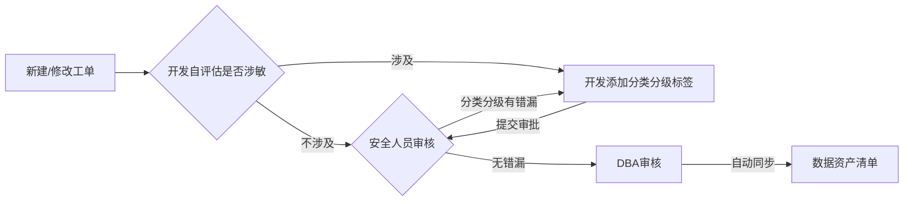
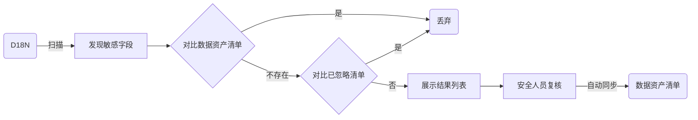

# 数据分类分级目的	

* 满足安全合规要求：《数据安全法》
* 降低业务安全风险：识别重要敏感数据、分布情况和使用场景，制定有效防护措施
* 满足业务需求：数据分类分级协助数据治理

## 1.1 数据分类分级思路

* 制度：依据法律法规和公司要求制定分类分级制度、分类规则、分级规则
* 工具：数据管理平台、数据扫描工具、监控审计平台
* 运营：入库打标签流程、存量扫描流程
* 成果：数据资产清单、数据安全地图、数据监控大盘

## 1.2 制度

* 金融业：中国人民银行印发的《JRT 0197-2020金融数据安全 数据安全分级指南》
* 医疗健康行业：《GB_T 39725-2020 信息安全技术 健康医疗数据安全指南》

## 1.3 工具

* 数据资产管理平台：自研或商业版
* 敏感数据识别工具：开源**D18N**软件
* 数据安全监控大盘：**grafana**

## 1.4 流程建设

* 入库阶段数据分类分级

* 存量数据分类分级

