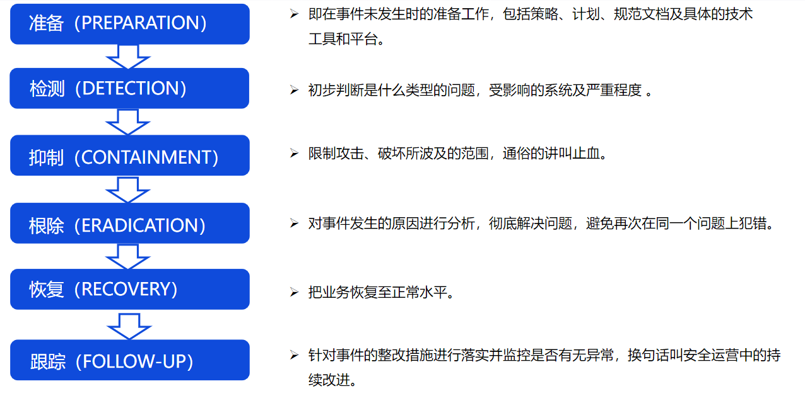

## 1.自适应安全框架

安全防护是一个持续长期的过程，自动适应不断变化的网络和威胁环境，不断优化防御机制

## 2.应急响应标准

* GB/T 24363-2009  《信息安全应急响应计划规范》
* GB/Z 20985-2007 《信息安全事件管理指南》
* GB/Z 20986-2007 《信息安全事件分类分级指南》

* 《银行业重要信息系统突发事件应急管理规范(试行)》
* 《银行、证券跨行业信息系统突发事件应急处置工作指引》

## 3.PDCERF模型

### 3.1事件分类

《信息安全事件分类指南》GB/Z20986-2007

* 恶意程序事件
* 网络攻击事件
* 信息破坏事件
* 信息内容安全事件
* 设备设施故障
* 灾害性事件
* 其他信息安全事件

### 3.2准备阶段

#### 3.2.1应急响应制度

* 应急团队建设/职责分工
* 应急方案制定/应急处置流程/事件分类和分级
* 安全基线检查
* 渗透测试评估

#### 3.2.2安全产品和工具搭建

* 日志分析类
* 安全防护类（WAF、HIDS、防病毒等）
* 关联分析平台（SOC、态势感知）

### 3.3检测阶段

* 判断事件类型
* 判断事件级别和受影响系统
* 确定应急方案

### 3.4抑制阶段

* 阻断：IP、端口、网络连接、扫描
* 关闭：可疑进程、服务
* 删除：违规账号、病毒/木马/后门文件

### 3.5根除阶段

按时间线还原整个事件流程和根因分析

* 增强：安全策略、威胁监控
* 修复：应用漏洞、系统漏洞、补丁更新
* 还原：操作系统、业务系统

### 3.6恢复阶段

* 恢复业务系统
* 恢复用户数据
* 恢复网络通信

### 3.7跟踪总结阶段

回顾并整合应急响应过程中的相关信息，进行事后分析总结和安全加固计划，并进行训练，防止入侵再次发生

* 事件会议总结
* 响应报告输出
* 响应工作优化

改进点落实到具体责任、时间期限