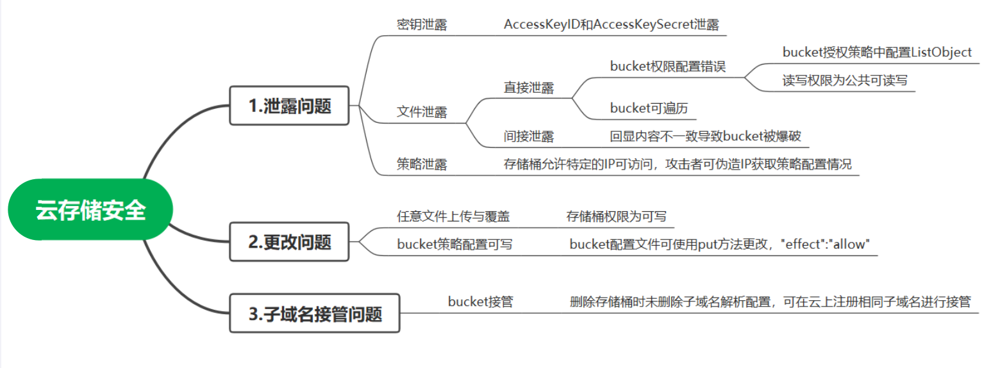
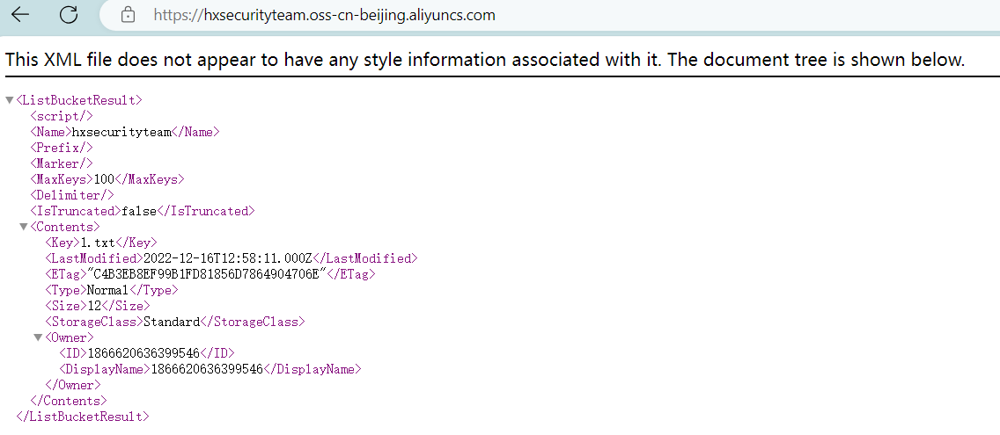

## 0x01 云存储安全


### 1.四种存储桶显示页面
* 无存储桶时: `InvalidBucketName`
* 没有该存储桶: `NoSuchBucket`
* 有存储桶时: 列出所有存储对象

* 无访问权限: `AccessDenied`


### 2.攻击方式

阿里云存储攻防
https://zone.huoxian.cn/d/918-oss

aws-s3云存储攻防
https://zone.huoxian.cn/d/907-aws-s3

腾讯云COS云存储攻防
https://zone.huoxian.cn/d/949-cos

## 0x02 云上密钥特征及连接方式
### 1. 密钥特征
```
1）阿里云
accessKeyId
accessKeySecret

2）华为云
huawei.oss.ak
huawei.oss.sk
huawei.oss.bucket.name
huawei.oss.endpoint
huawei.oss.local.path

3）Google云
private_key_id
private_key

4）微软云
AccountName
AccountKey

5）腾讯云
SecretId
SecretKey

6）亚马逊云-AWS
aws_access_key_id
aws_secret_access_key
```

### 2.密钥连接工具
* [cloudTools](https://github.com/dark-kingA/cloudTools)
* [行云管家](https://www.cloudbility.com/)