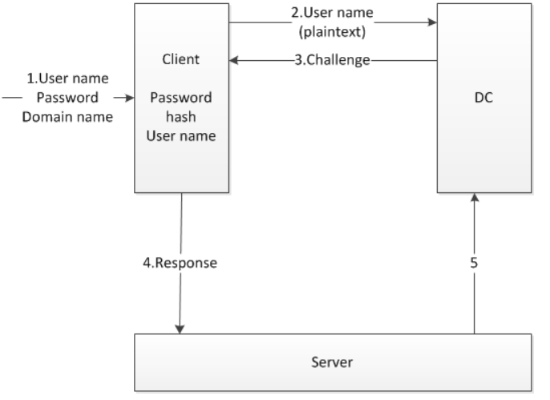

流程

1、客户端向服务器发起认证

2、服务端收到请求后，生成一个16位的随机数（Challenge），明文发回客户端，并使用登录用户密码hash加密Challenge，获得Challenge1

3、客户端收到Challenge后，使用登录用户的密码hash对Challenge加密，获得Challenge2（response），发送给服务端

4、服务器接收客户端加密后的response，比较Challenge1和response，如果相同，验证成功。