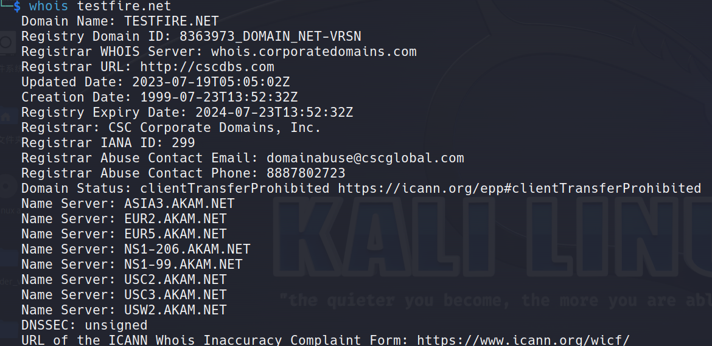
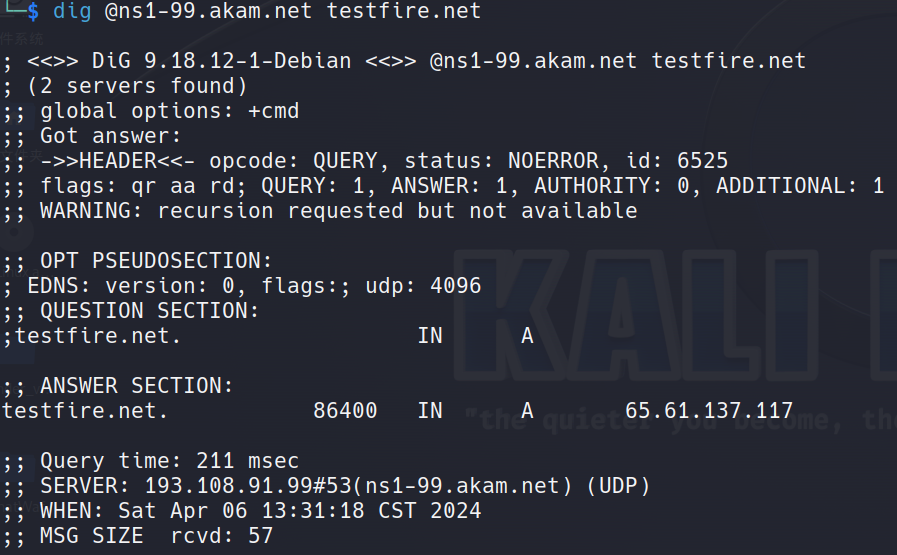
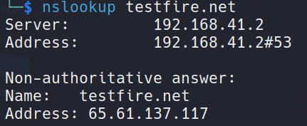
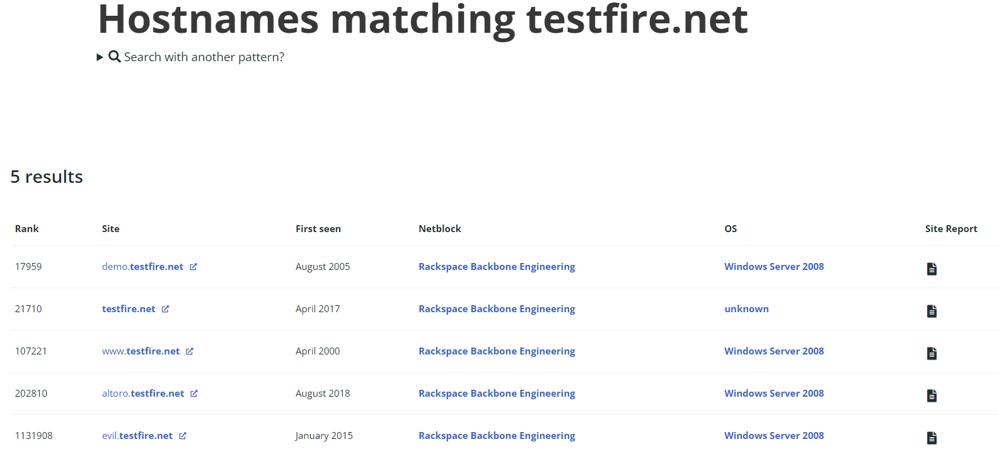
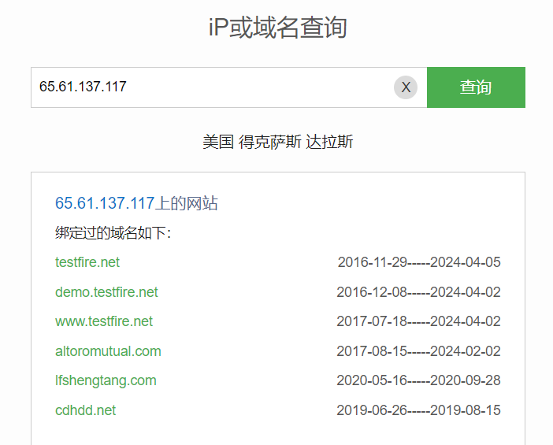
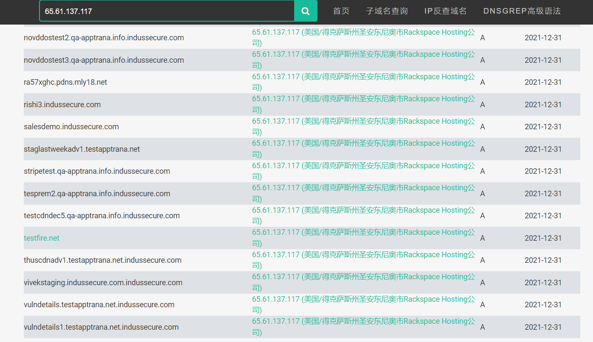
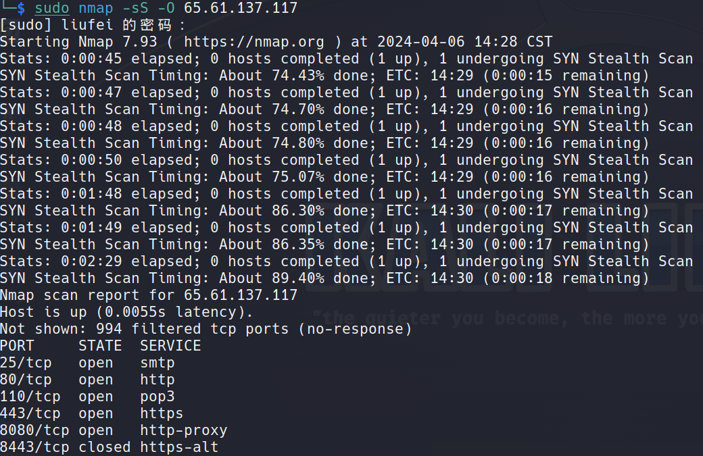

## 1.外围信息搜集

公开信息搜集OSINT（Open Source INTelligence)

## 1.1 通过域名和IP挖掘网络信息

* whois域名注册信息查询



* dig域名查询：从域名的官方DNS服务器获取权威回答

```
dig @<DNS域名服务器> <待查询域名>
```



* nslookup域名查询：只从DNS解析服务器保存在cache缓存中获得非权威回答



* IP2Location地理位置查询

https://www.ip2location.com/

https://www.maxmind.com/

国内纯真数据库：https://www.cz88.net/

* 子域名查询

https://searchdns.netcraft.com/



goby插件SubDomainsBrute

* IP反查域名

https://www.dnsgrep.cn/



https://site.ip138.com/



## 1.2 搜索引擎

* Google Hacking技术

**Johnny Long**的书籍[Google Hacking For Penetration Testers.pdf](./Google Hacking For Penetration Testers.pdf)

参考Google黑客数据库：https://www.exploit-db.com/google-hacking-database

Site Digger自动化工具：https://sitedigger.apponic.com/download/

* 网站目录

网站目录扫描： [dirsearch](https://github.com/maurosoria/dirsearch)

MetaSploit的brute_dirs、dir_listing、dir_scanner模块

* 搜索网站中的邮件地址

MetaSploit的search_email_collector模块

# 2.端口扫描

* nmap扫描工具：https://nmap.org/docs.html

  

### 3.指纹识别

:bulb: [wappalyzer](https://www.wappalyzer.com/): 网站指纹识别插件

:bulb: [WhatWeb](https://github.com/urbanadventurer/WhatWeb): 网站指纹识别工具